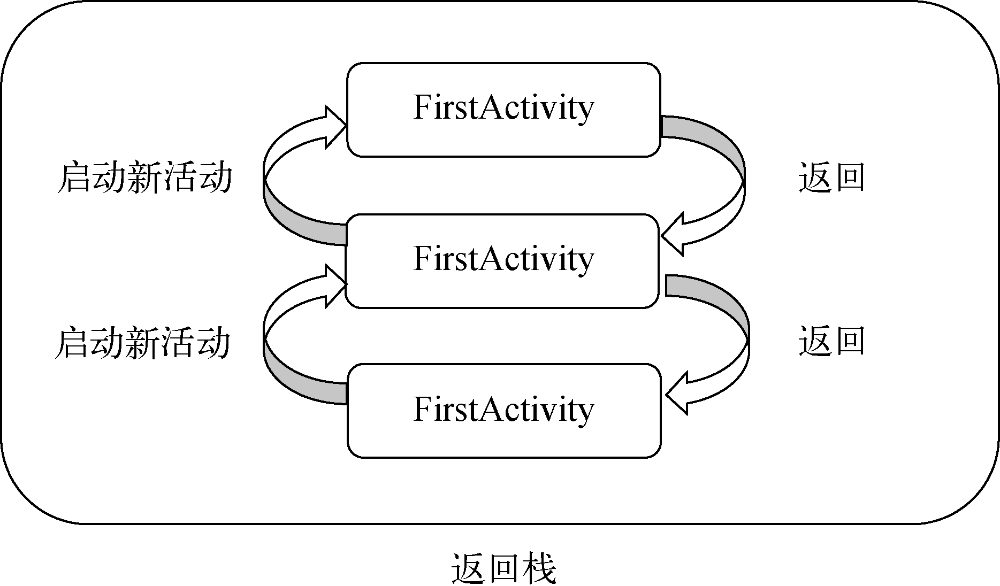
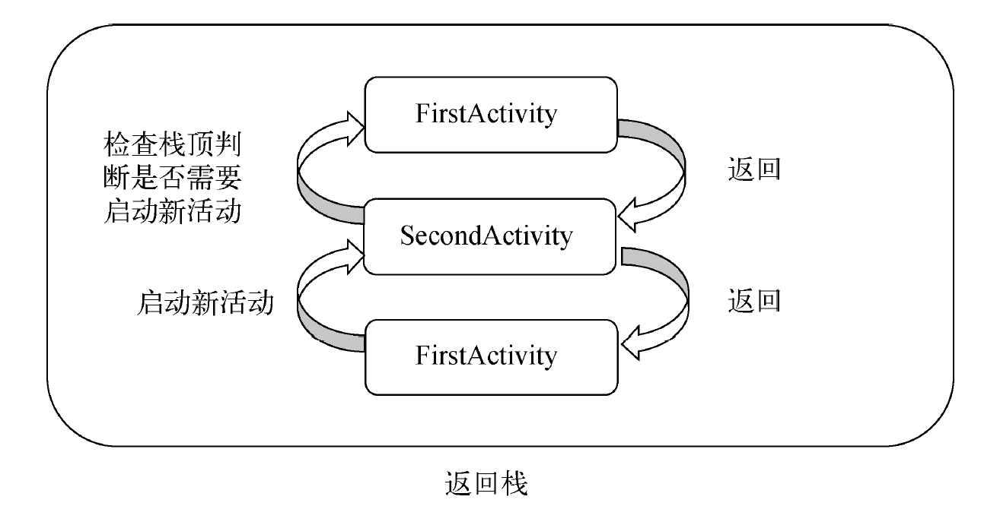
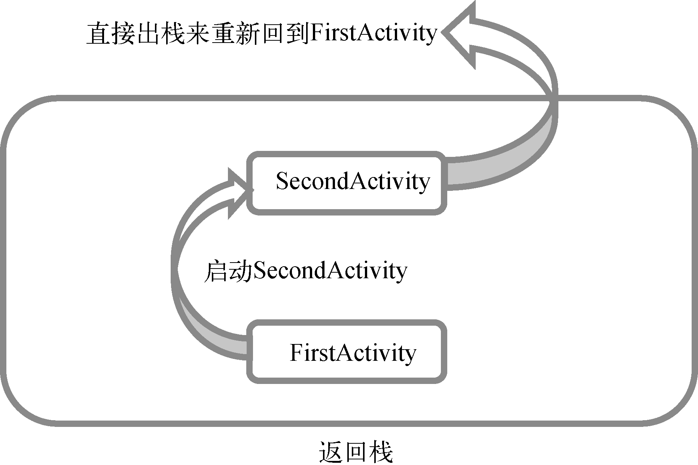
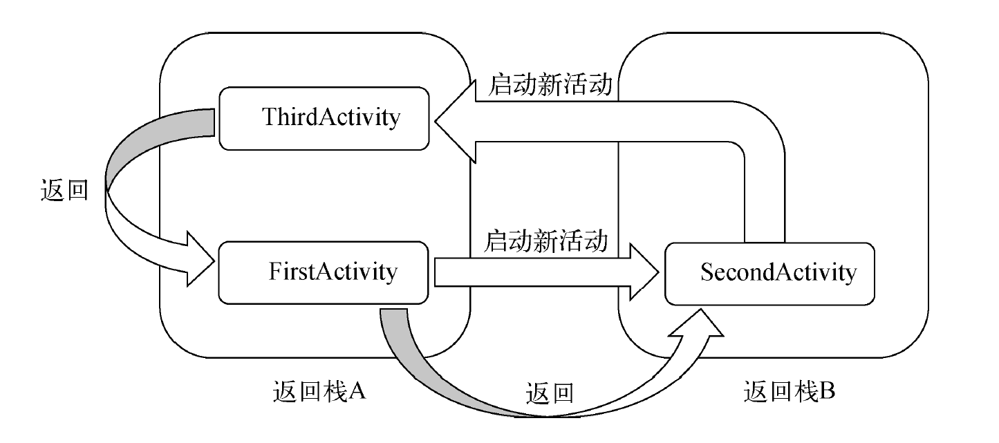

## Activity

Activity 是一种可以包含用户界面的组件，主要用于和用户进行交互，一个应用程序中可以包含零个或者多个 Activity。

### 获取在布局文件中定义的元素

通过 `findViewById()` 

```kotlin
val button1: Button = findViewById(R.id.button1)
```

Kotlin 编写的 Android 项目在 `app/build.gradle` 文件头部默认引入了一个 `kotlin-android-extensions` 插件，这个插件会根据布局文件中定义的控件 id 自动生成一个具有相同名称的变量。在 Activity 中可以直接使用这个变量。

```kotlin
import androidx.appcompat.app.AppCompatActivity
import android.os.Bundle
import android.widget.Toast
import kotlinx.android.synthetic.main.first_layout.*

class FirstActivity : AppCompatActivity() {

    override fun onCreate(savedInstanceState: Bundle?) {
        super.onCreate(savedInstanceState)
        setContentView(R.layout.first_layout)
        button1.setOnClickListener {
            Toast.makeText(this, "You clicked Button1", Toast.LENGTH_SHORT).show()
        }
    }
}
```

### 调用 Java Bean 结构的方法时简便写法

```kotlin
override fun onCreateOptionsMenu(menu: Menu?): Boolean {
    // menuInflater 为 调用 getMenuInflater() 获得的 MenuInflater 对象
    menuInflater.inflate(R.menu.main, menu)
    return true
}
```

Kotlin 中可以直接用 `.` 属性名的方式获取属性值，会自动转换成 getter 调用。设值同理，会自动转换为 setter 调用。

## 使用 Intent

Intent 是 Android 程序中各组件之间进行交互的一种重要方式。可以指明当前组件想要执行的动作，还可以在不同组件之间发传递数据。Intent 一般可以用于启动 Activity、启动 Service 以及发送广播等场景。

大致可以分为两种：显式 Intent、隐式 Intent

只有 `<action> `、`<category>` 中的内容同时匹配 Intent 中指定的 action 和 category 是，这个 Activity 才能相应该 Intent。

每个 Intent 中只能指定一个 action，可以指定多个 category 。

## Activity 的生命周期

Android 是使用任务（Task）来管理活动的，一个任务就是一组存放在栈里的 Activity 的集合，这个栈也被称作**返回栈（Back Stack）**。

### Activity 状态

每个活动在其生命周期中最多可能会有4 种状态。

- 运行状态

  当活动位于返回栈的栈顶时就处于这种状态，系统最不愿意回收的活动。

- 暂停状态

  当活动不再处于栈顶位置，但仍然可见时。因为并不是每一个活动都会占满整个屏幕。处于暂停状态的活动仍然是完全存活着的，系统也不愿意去回收这种活动。内存极低时系统才会考虑。

- 停止状态

  当一个活动不再处于栈顶位置，并且完全不可见的时候。系统仍然会为这种活动保存相应的状态和成员变量，但是这并不是完全可靠的，当其他地方需要内存时，处于停止状态的活动有可能会被系统回收。

- 销毁状态

  当一个活动从返回栈中移除后就变成了销毁状态。系统会最倾向于回收处于这种状态的活动。

### Activity 的生存期

Activity 类中定义了7 个回调方法，覆盖了 Activity 生命周期的每一个环节。

- `onCreate()`

  在 Activity 第一次被创建的时候调用。在这个方法中完成活动的初始化操作，比如说加载布局、绑定事件等。

- `onStart()`

  在 Activity 由不可见变为可见的时候调用。在这个方法中加载资源。

- `onResume()`

  在 Activity 准备好和用户进行交互的时候调用。此时的 Activity 一定位于返回栈的栈顶，并且处于运行状态。

- `onPause()`

  在系统准备去启动或者恢复另一个 Activity 的时候调用。通常会在这个方法中将一些消耗 CPU 的资源释放掉，以及保存一些关键数据，但这个方法的执行速度一定要快，不然会影响到新的栈顶 Activity 的使用。

- `onStop()`

  在 Activity 完全不可见的时候调用。它和 `onPause()` 方法的主要区别在于，如果启动的新活动是一个对话框式的活动，那么 `onPause()` 方法会得到执行，而 `onStop()` 方法并不会执行。

- `onDestroy()`

  在 Activity 被销毁之前调用，之后活动的状态将变为销毁状态。
  
- `onRestart()`

  在 Activity  由停止状态变为运行状态之前调用，也就是 Activity 被重新启动了。

以上 7 个方法中除了 `onRestart()` 方法，其他都是两两相对的，从而又可以将活动分为 3 种**生存期**。

- 完整生存期

  活动在 `onCreate()` 方法和 `onDestroy()` 方法之间所经历的。一般情况下，一个 Activity 会在 `onCreate()` 方法中完成各种初始化的操作，在 `onDestroy()` 方法中完成释放内存的操作。

- 可见生存期

  活动在 `onStart()` 方法和 `onStop()` 方法之间所经历的。在可见生存期内，Activity 对用户总是可见的。一般在 `onStart()` 方法中对资源进行加载，在 `stop()` 方法中对资源进行释放。

- 前台生存期

  活动在 `onResume()` 方法和 `onPause()` 方法之间所经历的。在前台生存期内，Activity 总是处于运行状态的。


### Activity 被回收了时如何恢复数据

Activity 中还提供了一个 `onSaveInstanceState()` 回调方法，这个方法可以保证在 Activity 被回收之前一定会被调用，因此我们可以通过这个方法来解决问题。

Bundle 提供了一系列的方法用于保存数据。

`onCreate()` 方法中的 Bundle 类型的参数会带有之前所保存的全部数据，取值恢复即可。

Intent 还可以结合 Bundle 一起用于传递数据，首先可以把需要传递的数据都保存在 Bundle 对象中，然后再将 Bundle 对象存放在 Intent 里。到了目标活动之后先从 Intent 中取出 Bundle，再从 Bundle 中一一取出数据。

## Activity 的启动模式

启动模式一共有4 种，分别是 **standard**、**singleTop**、**singleTask** 和 **singleInstance**，可以在`AndroidManifest.xml`中通过给`<activity>`标签指定`android:launchMode`属性来选择启动模式。

### standard

standard 是 Activity 默认的启动模式，在不进行显式指定的情况下，所有 Activity 都会自动使用这种启动模式。每当启动一个新的 Activity，它就会在返回栈中入栈，并处于栈顶的位置。对于使用 standard 模式的 Activity，系统不会在乎这个 Activity 是否已经在返回栈中存在，每次 Activity 都会创建该活动的一个新的实例。



### singleTop

当活动的启动模式指定为 singleTop，在启动 Activity 时如果发现返回栈的栈顶已经是该 Activity，则认为可以直接使用它，不会再创建新的 Activity 实例。未处于栈顶位置时，还是会创建新的实例的。

```xml
<activity
    android:name=".FirstActivity"
    android:launchMode="singleTop"
    android:label="This is FirstActivity">
    <intent-filter>
        <action android:name="android.intent.action.MAIN" />
        <category android:name="android.intent.category.LAUNCHER" />
    </intent-filter>
</activity>
```



### singleTask

每次启动该 Activity 时系统首先会在返回栈中检查是否存在该 Activity 的实例，如果发现已经存在则直接使用该实例，并把在这个 Activity 之上的所有活动统统出栈，如果没有发现就会创建一个新的 Activity 实例。



### singleInstance

指定为 singleInstance 模式的 Activity 会启用一个新的返回栈来管理这个 Activity（其实如果 singleTask 模式指定了不同的 taskAffinity，也会启动一个新的返回栈）。



## Activity 的最佳实践

### 知晓当前是在那一个 Activity

通过抽象出 BaseActivity，来日志打印出类名，从而容易判断出是哪一个活动。

Kotlin 中的 `javaClass` 表示获取当前实例的 Class 对象，相当于在 Java 中调用 `getClass()`。

Kotlin 中的 `BaseActivity::class.java` 表示获取 BaseActivity 类的 Class 对象，相当于在 Java 中调用 `BaseActivity.class`。

### 随时随地退出程序

通过 BaseActivity、ActivityCollector 来掌控所有活动的管理。

```kotlin
object ActivityCollector {

    private val activities = ArrayList<Activity>();

    fun addActivity(activity: Activity) {
        activities.add(activity)
    }

    fun removeActivity(activity: Activity) {
        activities.remove(activity)
    }

    fun finishAll() {
        for (activity in activities) {
            if (!activity.isFinishing) {
                activity.finish()
            }
        }
        activities.clear()
    }

}

@SuppressLint("Registered")
open class BaseActivity : AppCompatActivity() {

    override fun onCreate(savedInstanceState: Bundle?) {
        super.onCreate(savedInstanceState)
        Log.d("BaseActivity", javaClass.simpleName)
        ActivityCollector.addActivity(this)
    }

    override fun onDestroy() {
        super.onDestroy()
        ActivityCollector.removeActivity(this)
    }
}

class ThirdActivity : BaseActivity() {

    override fun onCreate(savedInstanceState: Bundle?) {
        super.onCreate(savedInstanceState)
        Log.d("ThirdActivity", "Task is is $taskId")
        setContentView(R.layout.third_layout)

        button3.setOnClickListener {
            ActivityCollector.finishAll()
            // kill 当前进程
            // killProcess() 只能用于杀掉当前程序的进程 不能用于杀掉其他程序
            android.os.Process.killProcess(android.os.Process.myPid())
        }
    }
}
```

### 启动 Activity 的最佳写法

为自己负责的活动编写 `actionStart` 方法，方便别人启动以及知悉必要参数。

```kotlin
class SecondActivity : BaseActivity() {
    ...
    companion object {
        fun actionStart(context: Context, data1: String, data2: String) {
            val intent = Intent(context, SecondActivity::class.java)
            intent.putExtra("param1", data1)
            intent.putExtra("param2", data2)
            context.startActivity(intent)
        }
    }
}
```

Kotlin 规定，所有定义在 `companion object` 中的方法都可以使用类似于 Java 静态方法调用的形式调用。

## Kotlin : 标准函数和静态方法

### 标准函数 with、run、apply

之前已经提到了 let 这个标准函数，它的主要作用就是配合 `?.` 操作符来进行辅助判空处理。

#### with

with 函数接收两个参数：第一个参数可以是一个任意类型的对象，第二个参数是一个 Lambda 表达式。

with 函数会在 Lambda 表达式中提供第一个参数对象的上下文，并使用 Lambda 表达式中的最后一行代码最为返回值返回。

```kotlin
val result = with(obj) {
    // 这里是 obj 的上下文
    "value" // with 函数的返回值
}
```

```kotlin
val list = listOf("Apple", "Banana", "Orange", "Pear", "Grape")
val result = with(StringBuilder()) {
    append("Start eating fruits.\n")
    for (fruit in list) {
        append(fruit).append("\n")
    }
    append("Ate all fruits.\n")
    toString()
}
println(result)
```

