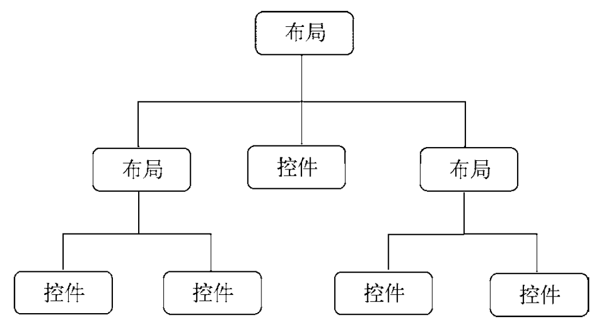

## 如何编写程序界面

Android 应用程序的界面主要是通过编写 XML 的方式来实现的。最近几年，Google 又推出了一个全新的界面布局：ConstraintLayout 。ConstraintLayout 不是非常适合通过编写 XML 的方式来开发界面，而是更加适合在可视化编辑器中使用拖放控件的方式来进行操作。

## 常用控件的使用方式

### TextView

`android:layout_width` 和 `android:layout_height` 指定了控件的宽度和高度，Android 中所有控件都具有这两个属性。

- `match_parent` 

  让当前控件的大小和父布局的大小一样，也就是由父布局来决定当前控件的大小。

- `wrap_content`

  让当前控件的大小能够刚好包含住里面的内容，也就是由控件内容决定当前控件的大小。
  
- 固定值 / dp

  dp 是一种与屏幕密度无关的尺寸单位，可以保证不同分辨率的手机上的显示效果尽可能地一致。

`android:gravity` 来指定文字的对齐方式，可以用“|”来同时指定多个值，指定的 `center`，效果等同于 `center_vertical|center_horizontal`，表示文字在垂直和水平方向都居中对齐。

`android:textColor` 属性可以指定文字的颜色。

`android:textSize` 属性可以指定文字的大小。文字大小要使用 sp 作为单位，当用户在系统中修改了文字显示尺寸时，应用程序中的文字大小也会跟着变化。

### Button

Android 系统默认会将按钮上的英文字母全部转换成大写。可以使用配置来禁用这一默认特性：`android:textAllCaps="false"` 。

### EditText

`android:hint` 属性用来指定一段提示性的文本。

`android:maxLines` 指定 EditText 的最大行数，这样当输入的内容超过指定的行数时，文本就会向上滚动，而 EditText 则不会再继续拉伸。

`editText.text.toString()` 获取文本内容。

### ImageView

修改显示的图片：`ImageView.setImageResource(R.drawable.img_2)`

### ProgressBar

ProgressBar 用于在界面上显示一个进度条，表示我们的程序正在加载一些数据。
`android:visibility` 是所有的 Android 控件都具有的可见属性。

- visibl

  可见的，默认值。

- invisible

  不可见，但是它仍然占据着原来的位置和大小，可以理解成控件变成透明状态了。

- gone

  控件不仅不可见，而且不再占用任何屏幕空间。

获取/设置 ProgressBar 状态：`getVisibility()/setVisibility()`

获取/设置 ProgressBar 的当前进度：`getProgress()/setProgress()`

### AlertDialog

AlertDialog 可以在当前的界面弹出一个对话框，这个对话框是置顶于所有界面元素之上的，能够屏蔽掉其他控件的交互能力，因此 AlertDialog 一般都是用于提示一些非常重要的内容或者警告信息。

```kotlin
AlertDialog.Builder(this).apply {
    setTitle("This is Dialog")
    setMessage("Something important.")
    setCancelable(false)
    setPositiveButton("OK") { dialog, which ->
    }
    setNegativeButton("Cancel") { dialog, which ->
    }
    show()
}
```

## 三种基本布局

布局是一种可用于放置很多控件的容器，它可以按照一定的规律调整内部控件的位置。布局的内部除了放置控件外，也可以放置布局，可以嵌套。



### LinearLayout

LinearLayout 会将它所包含的控件在线性方向上依次排列。

`android:orientation` 指定排列方向是 `vertical` 还是 `horizontal` 。

如果 LinearLayout 的排列方向是 horizontal，内部的控件就绝对不能将宽度指定为 match_parent，因为这样的话，单独一个控件就会将整个水平方向占满，其他的控件就没有可放置的位置了。同样的道理，如果 LinearLayout 的排列方向是 vertical，内部的控件就不能将高度指定为 match_parent 。

`android:gravity` 用于指定文字在控件中的对齐方式。

`android:layout_gravity` 用于指定控件在布局中的对齐方式。

当 LinearLayout 的排列方向是 horizontal 时，只有垂直方向上的对齐方式才会生效，因为此时水平方向上的长度是不固定的，每添加一个控件，水平方向上的长度都会改变，因而无法指定该方向上的对齐方式。

同样的道理，当 LinearLayout 的排列方向是 vertical 时，只有水平方向上的对齐方式才会生效。

`android:layout_weight` 可以用于按照比例分配屏幕宽度，比较规范的写法是使用 `android:layout_weight` 时，同时指定 `android:layout_width="0dp"` 。

### RelativeLayout 

RelativeLayout 可以通过相对定位的方式让控件出现在布局的任何位置。RelativeLayout 中的属性非常多。

布局属性都记录在 [`RelativeLayout.LayoutParams`](https://developer.android.com/reference/android/widget/RelativeLayout.LayoutParams) 。

相对于父布局定位、相对于控件定位。

- `android:layout_alignParentTop` 使该视图的**顶部边缘**与父视图的顶部边缘匹配。
- `android:layout_alignParentBottom` 使该视图的**底部边缘**与父视图的底部边缘匹配。
- `android:layout_centerInParent` 将此子级**在其父级中水平和垂直居中**。
- `android:layout_alignParentStart` 使该视图的**起始边缘**与父视图的起始边缘匹配。
- `android:layout_alignParentEnd` 使该视图的**末端边缘**与父视图的末端边缘匹配。 
- `android:layout_alignParentLeft` 使该视图的**左边缘**与父视图的左边缘匹配。
- `android:layout_alignParentRight` 使该视图的**右边缘**与父视图的右边缘匹配。
- `android:layout_above` 将此视图的**底边边缘**定位在给定的锚视图ID**上方**。
- `android:layout_below` 将此视图的**顶部边缘**定位在给定的锚视图ID**之下**。
- `android:layout_toStartOf` 将此视图的**末端边缘**定位到给定锚视图ID的起点。
- `android:layout_toEndOf` 将此视图的**开始边缘**定位到给定锚视图ID的末尾。
- `android:layout_toLeftOf` 将此视图的**右边缘**定位到给定的锚视图ID的左侧。
- `android:layout_toRightOf` 将此视图的**左边缘**定位在给定的锚视图ID的右侧。

### **FrameLayout**

FrameLayout 所有的控件都会默认摆放在布局的左上角。

## 创建自定义控件

所有控件都是直接或间接继承自 View 的，所有的布局都是直接或间接继承自 ViewGroup 的。

View 是 Android 中最基本的一种 UI 组件，它可以在屏幕上绘制一块矩形区域，并能响应这块区域的各种事件，因此，我们使用的各种控件其实就是在 View 的基础之上又添加了各自特有的功能。

而 ViewGroup 则是一种特殊的 View，它可以包含很多子 View 和子 ViewGroup，是一个用于放置控件和布局的容器。


