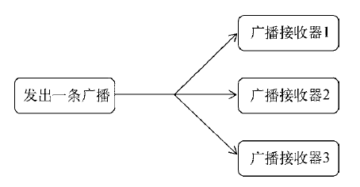
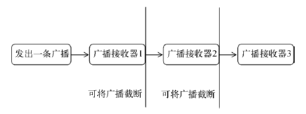
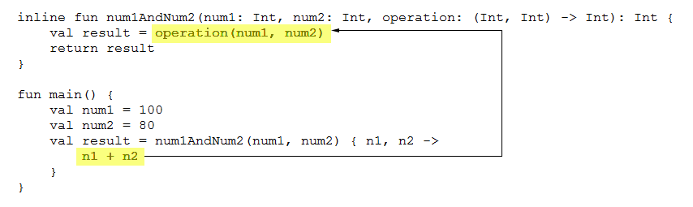
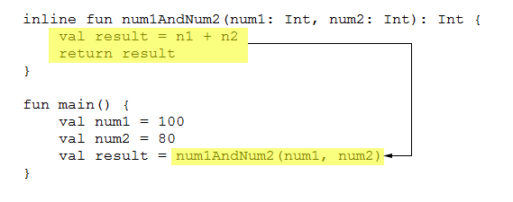
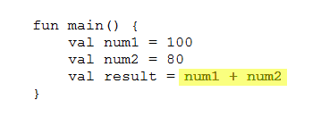
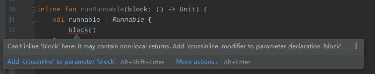

## 广播机制简介

Android 中的广播主要可以分为两种类型：**标准广播**和**有序广播**。

- **标准广播**（normal broadcasts）是一种完全异步执行的广播，在广播发出之后，所有的 BroadcastReceiver 几乎都会在同一时刻接收到这条广播消息，因此它们之间没有任何先后顺序可言。这种广播的效率会比较高，但同时也意味着它是无法被截断的。

  

- **有序广播**（ordered broadcasts）则是一种同步执行的广播，在广播发出之后，同一时刻只会有一个 BroadcastReceiver 能够收到这条广播消息，当这个 BroadcastReceiver 中的逻辑执行完毕后，广播才会继续传递。所以此时的 BroadcastReceiver 是有先后顺序的，优先级高的 BroadcastReceiver 就可以先收到广播消息，并且前面的 BroadcastReceiver 还可以截断正在传递的广播，这样后面的 BroadcastReceiver 就无法收到广播消息了。

  

## 接收系统广播

Android 内置了很多系统级别的广播，可以在应用程序中通过监听这些广播来得到各种系统的状态信息。

### 动态注册监听时间变化

注册 BroadcastReceiver 的方式一般有两种，在代码中注册和在 AndroidManifest.xml 中注册，其中前者也被称为**动态注册**，后者也被称为**静态注册**。

创建一个 BroadcastReceiver 需要新建一个类，让它继承自 BroadcastReceiver，并重写父类的 `onReceive()` 方法即可。当广播到来时， `onReceive()` 方法就会得到执行。

完整的系统广播列表可以到如下路径中去查看：

```
<Android SDK>\platforms\<任意 android api 版本>\data\broadcast_actions.txt
```

### 静态注册实现开机启动

理论上说动态注册能监听到的系统广播，静态注册也应该能监听到，在过去的 Android 系统中确实是这样。

由于大量恶意的应用程序利用这个机制在程序未启动的情况下监听系统广播，从而使任何应用都可以频繁地从后台被唤醒，严重影响了用户手机的电量和性能。

因此 Android 系统几乎每个版本都在削减静态注册 BroadcastReceiver 的功能。

在 Android 8.0 系统之后，所有**隐式广播**都不允许使用静态注册的方式来接收了。隐式广播指的是那些没有具体指定发送给哪个应用程序的广播，大多数系统广播属于隐式广播，但是少数特殊的系统广播目前仍然允许使用静态注册的方式来接收。

这些特殊的系统广播列表详见 [Implicit Broadcast Exceptions](https://developer.android.com/guide/components/broadcast-exceptions)

如果程序需要进行一些对用户来说比较敏感的操作，必须在 AndroidManifest.xml 文件中进行权限声明，否则程序将会直接崩溃。Android 6.0 系统中引入了更加严格的运行时权限。

```xml
<uses-permission android:name="android.permission.RECEIVE_BOOT_COMPLETED" />
```

不要在 `onReceive()` 方法中添加过多的逻辑或者进行任何的耗时操作，因为在 BroadcastReceiver 中是不允许开启线程的，当 `onReceive()` 方法运行了较长时间而没有结束时，程序就会报错。

## 发送自定义广播

默认情况下我们发出的自定义广播都是隐式广播，为了让静态注册的 BroadcastReceiver 能够接收到，调用 `setPackage()` 方法，指定这条广播发送给哪个应用程序的，从而让它变成一条显式广播。

```kotlin
button.setOnClickListener {
    val intent = Intent("com.homurax.broadcasttest.MY_BROADCAST")
    intent.setPackage(packageName)
    sendBroadcast(intent)
}
```

### 发送有序广播

指定优先级

```xml
<receiver
    android:name=".MyBroadcastReceiver"
    android:enabled="true"
    android:exported="true">
    <intent-filter android:priority="100">
        <action android:name="com.homurax.broadcasttest.MY_BROADCAST" />
    </intent-filter>
</receiver>
```

发送有序广播

```kotlin
button.setOnClickListener {
    val intent = Intent("com.homurax.broadcasttest.MY_BROADCAST")
    intent.setPackage(packageName)
    // 有序广播
    sendOrderedBroadcast(intent, null)
}
```

截断广播

```kotlin
override fun onReceive(context: Context, intent: Intent) {
    Toast.makeText(context, "received in MyBroadcastReceiver", Toast.LENGTH_LONG).show()
    // 广播截断
    abortBroadcast()
}
```

## BroadcastReceiver 的最佳实践：实现强制下线功能

重写 `onResume()` 和 ` onPause()` 这两个生命周期函数，然后分别在这两个方法里注册和取消注册 ForceOfflineReceiver。

始终只需要保证只有处于栈顶的 Activity 才能接收到强制下线广播，非栈顶的 Activity 不应该也没必要接收这条广播，所以写在  `onResume()` 和 ` onPause()` 方法里就可以很好的解决这个问题，当一个 Activity 失去栈顶位置时就会自动取消 BroadcastReceiver 的注册。

## Kotlin: 高阶函数

### 高阶函数

像接收 Lambda 参数的函数可以称为具有函数式编程风格的 API，如果想要定义自己的函数式 API，那就需要借助高阶函数来实现了。

**如果一个函数接收另一个函数作为参数，或者返回值的类型是另一个函数，那么该函数就称为高阶函数。**


函数类型基本规则：

```
(String, Int) -> Unit
```

`->` 左边的部分用来声明该函数接收什么参数，多个参数用逗号隔开，如果不接受任何参数，写一对空括号就可以了。

`->` 右边的部分用于声明该函数的返回值是什么类型，如果没有返回值就使用 Unit，它大致上相当于 Java 中的 void。

将函数类型添加到某个函数的参数声明或者返回值声明上，那么这个函数就是一个高阶函数了：

```kotlin
fun example(func: (String, Int) -> Unit) {
    func("hello", 123)
}
```

**高阶函数允许让函数类型的参数决定函数的执行逻辑。**

```kotlin
fun num1AndNum2(num1: Int, num2: Int, operation: (Int, Int) -> Int): Int {
    val result = operation(num1, num2)
    return result
}

fun plus(num1: Int, num2: Int): Int {
    return num1 + num2
}

fun minus(num1: Int, num2: Int): Int {
    return num1 - num2
}

val result1 = num1AndNum2(num1, num2, ::plus)
val result2 = num1AndNum2(num1, num2, ::minus)
```

`::plus` 是一种函数引用方式的写法，表示将 `plus()` 函数作为参数传递给 `num1AndNum2()` 函数。

**Kotlin 支持多种方式来调用高阶函数，比如 Lambda 表达式、匿名函数、成员引用等。**

```kotlin
val result1 = num1AndNum2(num1, num2) { n1, n2 ->
    n1 + n2
}
val result2 = num1AndNum2(num1, num2) { n1, n2 ->
    n1 - n2
}
```

在函数类型的前面加上了一个 `StringBuilder.` 的语法结构。

这是定义高阶函数完整的语法规则，**在函数类型前面加上 `ClassName.` 就表示这个函数类型是定义在哪个类当中**。

这样当调用 build 函数时传入的 Lambda 表达式将会自动拥有 StringBuilder 的上下文。

同时这也是 apply 函数的实现方式。

```kotlin
fun StringBuilder.build(block: StringBuilder.() -> Unit): StringBuilder {
    block()
    return this
}

val list = listOf("Apple", "Banana", "Orange", "Pear", "Grape")
val result = StringBuilder().build {
    append("Start eating fruits.\n")
    for (fruit in list) {
        append(fruit).append("\n")
    }
    append("Ate all fruits.")
}
```

### 内联函数

Lambda 表达式在底层被转换成了匿名类的实现方式。Kotlin 提供了**内联函数**的功能，它可以将使用 Lambda 表达式带来的运行时开销完全消除。

内联函数只需要在定义高阶函数时加上 **`inline`** 关键字声明即可。

Kotlin 编译器会将内联函数中的代码在编译的时候自动替换到调用它的地方，这样也就不存在运行时的开销了。

首先，Kotlin 编译器会将 Lambda 表达式中的代码替换到**函数类型参数调用的地方**。



接下来，再将内联函数中的全部代码替换到**函数调用的地方**。



最终代码被替换为如下的样子。



### noinline 与 crossinline

#### noinline 

一个高阶函数中如果接收了两个或者更多函数类型的参数，并且给高阶函数加上了 inline 关键字，那么 Kotlin 编译器会自动将所有引用的 Lambda 表达式全部进行内联。

如果只想内联其中的一个 Lambda 表达式，可以使用 **`noinline`** 关键字。

```kotlin
inline fun inlineTest(block: () -> Unit, noinline block2: () -> Unit) {}
```

内联的函数类型参数在编译的时候会被进行代码替换，因此它没有真正的参数属性。

非内联的函数类型参数可以自由地传递给其他任何函数，因为它就是一个真实的参数，而内联的函数类型参数只允许传递给另外一个内联函数，这也是它最大的局限性。

内联函数和非内联函数还有一个重要的区别，内联函数所引用的 Lambda 表达式中是可以使用 return 关键字来进行函数返回的，而**非内联函数只能进行局部返回**。

```kotlin
fun printString(str: String, block: (String) -> Unit) {
    println("printString begin")
    block(str)
    println("printString end")
}

fun main() {
    println("main start")
    var str = ""
    printString(str) { s ->
        println("lambda start")
        if (s.isEmpty()) {
            return@printString
        }
        println(s)
        println("lambda end")
    }
    println("main end")
}
```

**`return@printString` 的写法表示进行局部返回，并且不会再执行 Lambda 表达式的剩余部分代码。**

输出：

```
main start
printString begin
lambda start
printString end
main end
```


```kotlin
inline fun printString(str: String, block: (String) -> Unit) {
    println("printString begin")
    block(str)
    println("printString end")
}

fun main() {
    println("main start")
    var str = ""
    printString(str) { s ->
        println("lambda start")
        if (s.isEmpty()) {
            return
        }
        println(s)
        println("lambda end")
    }
    println("main end")
}
```

此时 `printString()` 函数为内联函数，可以在 Lambda 表达式中使用 return 关键字了。此时的 return 代表的是返回外层的调用函数，也就是 `main()` 函数。

输出：

```
main start
printString begin
lambda start
```

#### crossinline



在 Runnable 的 Lambda 表达式中调用了传入的函数类型参数。Runnable 的 Lambda 表达式在编译的时候会被转成匿名类的实现方式。

上述代码实际上是在匿名类中，调用了传入的参数类型。

而内联函数所引用的 Lambda 表达式允许使用 return 关键字进行函数返回，但是由于这里是在匿名类中调用的函数类型参数，此时是不可能进行外层调用函数返回的，最多只能对匿名类中的函数调用进行返回，因此提示了上述错误。

**如果我们在高阶函数中创建了另外的 Lambda 或者匿名类的实现，并且在这些实现中调用函数类型参数，此时再将高阶函数声明成内联函数，就一定会提示错误。**

使用 **`crossinline`** 关键字。

```kotlin
inline fun runRunnable(crossinline block: () -> Unit) {
    val runnable = Runnable {
        block()
    }
    runnable.run()
}
```

声明 crossinline 之后，就无法在调用 `runRunnable()` 函数时的 Lambda 函数式使用 return 关键字进行函数返回了，但是仍然可以使用 `return@runRunnable` 的写法进行局部返回。

crossinline 保证了内联函数除了 return 关键字的使用上以外的其他所有特性。