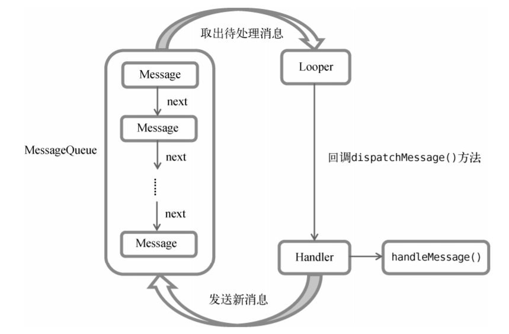
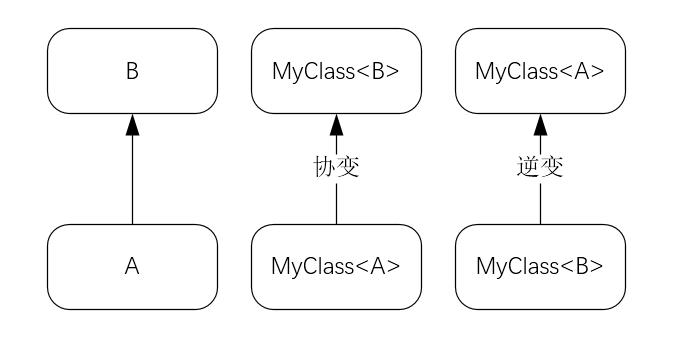

## Service 是什么

Service 是 Android 中实现程序后台运行的解决方案，它非常适合去执行那些不需要和用户交互而且还要求长期运行的任务。Service 的运行不依赖于任何用户界面，即使程序被切换到后台，或者用户打开了另外一个应用程序，Service 仍然能够保持正常运行。

Service 并不是运行在一个独立的进程当中的，而是依赖于创建 Service 时所在的应用程序进程。当某个应用程序进程被杀掉时，所有依赖于该进程的 Service 也会停止运行。

Service 并不会自动开启线程，所有的代码都是默认运行在主线程当中的。我们需要在 Service 的内部手动创建子线程，并在这里执行具体的任务。

## Android 多线程编程

### 线程的基本用法

与 Java 基本是使用相同的语法。

新建一个类继承 Thread，然后重写父类的 `run()` 方法。

```kotlin
class MyThread : Thread() {
    override fun run() {
        // TODO
    }
}
// 启动
MyThread().start()
```

使用继承的方式耦合性高，更多地选择使用实现 Runnable 接口的方式来定义一个线程。

```kotlin
class MyThread : Runnable {
    override fun run() {
        // TODO
    }
}
// 启动
val myThread = MyThread()
Thread(myThread).start()
```

如果不想专门再定义一个类去实现 Runnable 接口，也可以使用 Lambda 的方式。

```kotlin
Thread {
    // TODO
}.start()
```

Kotlin 提供了一种更加简单的开启线程的方式。

```kotlin
thread { 
    // TODO
}
```

thread 是一个 Kotlin 内置的顶层函数，只需要在 Lambda 式中编写具体的逻辑就可以了，连 `start()` 方法都不用调用。

### 在子线程中更新 UI

Android 不允许在子线程中进行 UI 操作，但是有时必须在子线程里去执行一些耗时任务，然后根据任务的执行结果来更新相应的 UI 控件。对于这种情况，Android 提供了一套异步消息处理机制，解决了在子线程中进行 UI 操作的问题。

```kotlin
class MainActivity : AppCompatActivity() {

    val updateText = 1

    val handler =  object : Handler() {
        override fun handleMessage(msg: Message) {
            when (msg.what) {
                updateText -> textView.text = "Nice to meet you"
            }
        }
    }

    override fun onCreate(savedInstanceState: Bundle?) {
        super.onCreate(savedInstanceState)
        setContentView(R.layout.activity_main)
        changeTextBtn.setOnClickListener {
            thread {
                val msg = Message()
                msg.what = updateText
                // 发送 Message 对象
                handler.sendMessage(msg)
            }
        }
    }
}
```

`handleMessage()` 方法中代码是在主线程当中进行的。

### 解析异步消息处理机制

Android 中的异步消息处理主要由 4 个部分组成：Message、Handler、MessageQueue 和 Looper。

- Message

  Message 是在线程之间传递的消息，它可以在内部携带少量的信息，用于在不同线程之间交换数据。可以使用 what 和 arg1 和 arg2 字段来携带一些整型数据，使用 obj 字段携带一个 Object 对象。

- Handler

  处理者主要是用于发送和处理消息的。发送消息一般是使用 Handler 的 `sendMessage()` 方法、`post()` 方法等，而发出的消息最终会传递到 Handler 的 `handleMessage()` 方法中。

- MessageQueue

  消息队列主要用于存放所有通过 Handler 发送的消息。这部分消息会一直存在于消息队列中，等待被处理。每个线程中只会有一个 MessageQueue 对象。

- Looper

  Looper 是每个线程中的 MessageQueue 的管家，调用 Looper 的 `loop()` 方法后，就会进入到一个无限循环当中，然后每当发现 MessageQueue 中存在一条消息，就会将它取出，并传递到 Handler 的 `handleMessage()` 方法中。每个线程中也只会有一个 Looper 对象。


异步消息处理机制整个流程，首先需要在主线程当中创建一个 Handler 对象，并重写 `handleMessage()` 方法。然后当子线程中需要进行 UI 操作时，就创建一个 Message 对象，并通过 Handler 将这条消息发送出去。之后这条消息会被添加到 MessageQueue 的队列中等待被处理，而 Looper 则会一直尝试从 MessageQueue 中取出待处理消息，最后分发回 Handler 的 `handleMessage()` 方法中。由于 Handler 是在主线程中创建的，所以此时 `handleMessage()` 方法中的代码也会在主线程中运行，于是在这里就可以安心地进行 UI 操作了。

异步消息处理机制流程示意图。



### 使用 AsyncTask

AsyncTask 是一个抽象类，创建一个子类去继承它，可以为 AsyncTask 类指定 3 个泛型参数。

- Params

  在执行 AsyncTask 时需要传入的参数，可用于在后台任务中使用。

- Progress

  后台任务执行时，如果需要在界面上显示当前的进度，则使用这里指定的泛型作为进度单位。

- Result

  当任务执行完毕后，如果需要对结果进行返回，则使用这里指定的泛型作为返回值类型。

一个最简单的自定义 AsyncTask 可以写成如下形式：

```kotlin
class DownloadTask : AsyncTask<Unit, Int, Boolean>() {
    ...
}
```

经常需要重写的方法有以下 4 个：

- `onPreExecute()`

  这个方法会在后台任务开始执行之前调用，用于进行一些界面上的初始化操作，比如显示一个进度条对话框等。

- `doInBackground(Params...)`

  这个方法中的所有代码都会在子线程中运行，我们应该在这里去处理所有的耗时任务。任务一旦完成就可以通过 return 语句来将任务的执行结果返回，如果 AsyncTask 的第三个泛型参数指定的是 Unit，就可以不返回任务执行结果。注意，在这个方法中是不可以进行 UI 操作的，如果需要更新 UI 元素，比如说反馈当前任务的执行进度，可以调用 `publishProgress(Progress...)` 方法来完成。

- `onProgressUpdate(Progress...)`

  当在后台任务中调用了 `publishProgress(Progress...)` 方法后，`onProgressUpdate(Progress...)` 方法就会很快被调用，该方法中携带的参数就是在后台任务中传递过来的。在这个方法中可以对 UI 进行操作，利用参数中的数值就可以对界面元素进行相应的更新。

- `onPostExecute(Result)`

  当后台任务执行完毕并通过 return 语句进行返回时，这个方法就很快会被调用。返回的数据会作为参数传递到此方法中，可以利用返回的数据来进行一些 UI 操作，比如说提醒任务执行的结果，以及关闭掉进度条对话框等。

比较完整的自定义 AsyncTask 形式：

```kotlin
class DownloadTask : AsyncTask<Unit, Int, Boolean>() {
    
    override fun onPreExecute() {
        progressDialog.show() // 显示进度对话框
    }

    override fun doInBackground(vararg params: Unit?) = try {
        while (true) {
            val downloadPercent = doDownload() // 虚构方法
            publishProgress(downloadPercent)
            if (downloadPercent >= 100) {
                break
            }
        }
        true
    } catch (e: Exception) {
        false
    }

    override fun onProgressUpdate(vararg values: Int?) {
        // 更新下载进度
        progressDialog.setMessage("Download ${values[0]}%")
    }

    override fun onPostExecute(result: Boolean?) {
        progressDialog.dismiss() // 关闭对话框
        if (result) {
            Toast.makeText(context, "Download succeeded", Toast.LENGTH_SHORT).show()
        } else {
            Toast.makeText(context, "Download failed", Toast.LENGTH_SHORT).show()
        }
    }
}
```

在 `doInBackground()` 方法中执行具体的耗时任务，在 `onProgressUpdate()` 方法中进行 UI 操作，在 `onPostExecute()` 方法中执行一些任务的收尾工作。

启动任务：

```kotlin
DownloadTask().execute()
```

可以给 `execute()` 方法传入任意数量的参数，这些参数会传递到 `doInBackground()` 方法中。

## Service 的基本用法

### 定义一个 Service

`onBind()` 方法是 Service 中唯一抽象方法。其他常用方法还有 `onCreate()` 、`onStartCommand()`、`onDestroy()` 这三个方法。

`onCreate()` 在 Service 创建的时候调用，`onStartCommand()` 方法会在每次 Service 启动的时候调用，`onDestroy()` 会在 Service 销毁的时候调用。

如果我们希望 Service 一旦启动就立刻去执行某个动作，就可以将逻辑写在 `onStartCommand()` 方法里。而当 Service 销毁时，应该在 `onDestroy()` 方法中去回收那些不再使用的资源。

### 启动和停止 Service

```kotlin
startServiceBtn.setOnClickListener {
    val intent = Intent(this, MyService::class.java)
    startService(intent)
}

stopServiceBtn.setOnClickListener {
    // Service 内部调用 stopSelf() 方法亦可自我停止
    val intent = Intent(this, MyService::class.java)
    stopService(intent)
}
```

从 Android 8.0 系统开始，应用的后台功能被大幅削减。现在只有当应用保持在前台可见状态的情况下，Service 才能保证稳定运行，一旦应用进入后台之后，Service 随时都有可能被系统回收。

如果真的非常需要长期在后台执行一些任务，可以使用前台 Service 或者 WorkManager 。

### Activity 和 Service 进行通信

当一个 Activity 和 Service 绑定了以后，就可以调用该 Service 里的 Binder 提供的方法了。

```kotlin
class MyService : Service() {

    private val mBinder = DownloadBinder()

    class DownloadBinder : Binder() {
        fun startDownload() {
            Log.d("MyService", "startDownload")
        }

        fun getProgress(): Int {
            Log.d("MyService", "getProgress")
            return 0
        }
    }

    override fun onBind(intent: Intent): IBinder {
        return mBinder
    }

    override fun onCreate() {
        super.onCreate()
        Log.d("MyService", "onCreate")
    }

    override fun onStartCommand(intent: Intent?, flags: Int, startId: Int): Int {
        Log.d("MyService", "onStartCommand")
        return super.onStartCommand(intent, flags, startId)
    }

    override fun onDestroy() {
        super.onDestroy()
        Log.d("MyService", "onDestroy")
    }
}
```

```kotlin
class MainActivity : AppCompatActivity() {

    lateinit var downloadBinder: MyService.DownloadBinder

    private val connection = object : ServiceConnection {
        // Activity 与  成功绑定时调用
        override fun onServiceConnected(name: ComponentName, service: IBinder) {
            downloadBinder = service as MyService.DownloadBinder
            downloadBinder.startDownload()
            downloadBinder.getProgress()
        }
        // Service 的创建进程崩溃或者被 kill 掉时调用
        override fun onServiceDisconnected(name: ComponentName) {
        }
    }

    override fun onCreate(savedInstanceState: Bundle?) {
        ...
        
        bindServiceBtn.setOnClickListener {
            val intent = Intent(this, MyService::class.java)
            // 绑定 Service
            // 标志位 BIND_AUTO_CREATE 表示绑定后自动创建 Service
            // 且 MyService 中 onCreate() 执行 onStartCommand() 不会执行
            bindService(intent, connection, Context.BIND_AUTO_CREATE)
        }

        unbindServiceBtn.setOnClickListener {
            unbindService(connection)
        }
    }
}
```

任何一个 Service 在整个应用程序范围内都是通用的，可以和任何一个其他的 Activity 进行绑定，而且在绑定完成后，它们都可以获取相同的 DownloadBinder 实例。

## Service 的生命周期


通过 `startService()` 方法启动 Service，就会回调 `onStartCommand()` 方法。如果这个 Service 还没有创建过，`onCreate()` 方法会先执行。Service 启动后一直处于运行状态，直到当 `stopService()` 或 `stopSelf()` 方法被调用，或者被系统回收。每调用一次 `startService()` 方法，`onStartCommand()` 方法就会执行一次，但是实际上 Service 只会存在一个实例。

通过调用 Context 的 `bindService()` 可以获取一个 Service 的持久连接，这时就会回调 Service 中的 `onBind()` 方法。类似地，如果这个 Service 之前还没有创建过，`onCreate()` 方法会先于 `onBind()` 方法执行。之后，调用方可以获取到 `onBind()` 方法里返回的 `IBinder` 对象的实例，这样就能自由地和 Service 进行通信了。只要调用方和服务之间的连接没有断开，服务就会一直保持运行状态。

对 Service 调用 `startService()` 方法后，还可以对这个 Service 调用 `bindService()` 方法。

根据 Android 系统的机制，一个 Service 只要被启动或者被绑定了之后，就会一直处于运行状态，必须要让以上两种条件同时不满足，Service 才能被销毁。所以，这种情况下要同时调用 `stopService()` 和 `unbindService()` 方法，`onDestroy()` 方法才会执行。

## Service 的更多技巧

### 使用前台 Service 

前台 Service 和普通 Service 最大的区别就在于，它会一直有一个正在运行的图标在系统的状态栏显示，下拉状态栏后可以看到更加详细的信息，非常类似于通知的效果。

从 Android 9.0 系统开始，使用前台 Service 必须进行权限声明：

```
<uses-permission android:name="android.permission.FOREGROUND_SERVICE" />
```

```kotlin
override fun onCreate() {
    super.onCreate()
    Log.d("MyService", "onCreate")
    // 就是创建通知的方式
    val manager = getSystemService(Context.NOTIFICATION_SERVICE) as NotificationManager
    if (Build.VERSION.SDK_INT >= Build.VERSION_CODES.O) {
        val channel = NotificationChannel("my_service", "前台Service通知", NotificationManager.IMPORTANCE_DEFAULT)
        manager.createNotificationChannel(channel)
    }
    val intent = Intent(this, MainActivity::class.java)
    val pi = PendingIntent.getActivity(this, 0, intent, 0)
    val notification = NotificationCompat.Builder(this, "my_service")
        .setContentTitle("This is content title")
        .setContentText("This is content text")
        .setSmallIcon(R.drawable.small_icon)
        .setLargeIcon(BitmapFactory.decodeResource(resources, R.drawable.large_icon))
        .setContentIntent(pi)
        .build()
    // 调用后就会让 MyService 变成一个前台 Service
    startForeground(1, notification)
}
```

### 使用 IntentService

Service 中的代码都是默认运行在主线程当中的，如果直接在 Service 里去处理一些耗时的逻辑，就很容易出现ANR（Application Not Responding）的情况。

Service 在执行完毕后自动停止。

```kotlin
class MyService : Service() {
    ...
    override fun onStartCommand(intent: Intent?, flags: Int, startId: Int): Int {
        Log.d("MyService", "onStartCommand")
        thread {
            // TODO
            stopSelf()
        }
        return super.onStartCommand(intent, flags, startId)
    }
    ...
}
```

这种写法并不复杂，但是总会有人忘记开启线程，或者忘记调用 `stopSelf()` 方法。

为了可以简单地创建一个异步的、会自动停止的服务，Android 专门提供了一个 IntentService 类。

```kotlin
class MyIntentService : IntentService("MyIntentService") {

    override fun onHandleIntent(intent: Intent?) {
        // 当前线程的id
        Log.d("MyIntentService", "Thread id is ${Thread.currentThread().name}")
    }

    override fun onDestroy() {
        super.onDestroy()
        Log.d("MyIntentService", "onDestroy")
    }

}
```

首先要求必须调用父类的构造函数，传入一个字符串，这个字符串可以随意指定，只在调试的时候有用。然后要
在子类中去实现 `onHandleIntent()` 这个抽象方法，在这个方法中可以去处理一些具体的逻辑，而且不用担心 ANR 的问题，因为这个方法已经是在子线程中运行的了。

## Kotlin：泛型的高级特性

### 对泛型进行实化

基于 JVM 的语言，泛型功能都是通过类型擦除机制来实现的。不同的是，Kotlin 提供了内联函数的概念，内联函数中的代码会在编译的时候自动被替换到调用它的地方，这样的话也就不存在什么泛型擦除的问题了，因为代码在编译之后会直接使用实际的类型来替代内联函数中的泛型声明。

**Kotlin 中是可以将内联函数中的泛型进行实化的。**

首先函数必须是内联函数才行，也就是需要用 inline 关键字来修饰函数。其次，在声明泛型的地方必须加上 **`reified`** 关键字来表示该泛型要进行实化。

```kotlin
inline fun <reified T> getGenericType() = T::class.java

fun main() {
    val result1 = getGenericType<String>()
    val result2 = getGenericType<Int>()
    println("result1 is $result1")
    println("result2 is $result2")
}
```

### 泛型实化的应用

泛型实化功能允许我们在泛型函数当中获得泛型的实际类型。

```kotlin
inline fun <reified T> startActivity(context: Context) {
    val intent = Intent(context, T::class.java)
    context.startActivity(intent)
}
// 启动 TestActivity
startActivity<TestActivity>(contex)


// 通过函数类型参数传递启动服务时可能需要的参数
inline fun <reified T> startActivity(context: Context, block: Intent.() -> Unit) {
    val intent = Intent(context, T::class.java)
    block(intent)
    context.startActivity(intent)
}
// 启动 TestActivity
startActivity<TestActivity>(contex) {
    putExtra("param1", "data")
    putExtra("param2", 12345)
}
```

### 泛型的协变

一个泛型类或者泛型接口中的方法，它的参数列表是接收数据的地方，因此可以称它为 in 位置，而它的返回值是输出数据的地方，因此可以称它为 out 位置。

```kotlin
open class Person(val name: String, val age: Int)

class Student(name: String, age: Int) : Person(name, age)

class Teacher(name: String, age: Int) : Person(name, age)
```

假如定义了一个 `MyClass<T>` 的泛型类，其中 A 是 B 的子类型，同时 `MyClass<A>` 又是 `MyClass<B>` 的子类型，就可以称 **MyClass 在 T 这个泛型上是协变的**。

如果一个泛型类在其泛型类型的数据上是只读的话，那么它是没有类型转换安全隐患的。也就是说 T 只能出现在 out 位置上，而不能出现在 in 位置上。

```kotlin
class SimpleData<out T>(val data: T?) {
    
    fun get(): T? {
        return data
    }
    
}
```

在泛型 T 的声明前面加上了 **`out`** 关键字，这就意味着 T 只能出现在 out 位置上，而不能出现在 in 位置上。SimpleData 在泛型 T 上是协变的。

构造函数中的泛型 T 尽管也在 in 位置上，但是使用了 val 关键字，所以构造函数中的泛型 T 任然是只读的，因此这样写是合法且安全的。即使使用了 var 关键字，只要给它加上 private 修饰符，保证这个泛型 T 对外部而言是不可修改的，那么都是合法的写法。

在 Java 中接收一个 `List<Person>` 类型的参数，是不允许传入 `List<Student>` 实例的。但是在 Kotlin 中这么做是合法的，因为 Kotlin 已经默认给许多内置的 API 加上了协变声明，其中就包括了各种集合的类与接口。

Kotlin 中的 List 本身就是只读的，如果想要给 List 添加数据，需要使用 MutableList。

List 简化版的源码：

```kotlin
public interface List<out E> : Collection<E> {

    override val size: Int
    override fun isEmpty(): Boolean
    override fun contains(element: @UnsafeVariance E): Boolean
    override fun iterator(): Iterator<E>
    override fun containsAll(elements: Collection<@UnsafeVariance E>): Boolean
    public operator fun get(index: Int): E
}
```

原则上在声明了协变后，泛型 E 就只能出现在 out 位置上，但是 `contains()` 方法中泛型 E 仍然出现在了 in 位置上。

泛型 E 出现在 in 位置上就意味着会有类型转换的安全隐患。但是 `contains()` 方法目的非常明确，它只判断当前集合中是否包含参数中传入的这个元素，而不会修改当前集合中的内容，因此这种操作实质上又是安全的。

为了能让编译器能够理解这里操作是安全的，所以使用了 `@UnsafeVariance` 注解。这样编译器就会允许泛型 E 出现在 in 位置上了。注意不要滥用。

### 泛型的逆变

假如定义了一个 `MyClass<T>` 的泛型类，其中 A 是 B 的子类型，同时 `MyClass<B>` 又是 `MyClass<A>` 的子类型，就可以称 **MyClass 在 T 这个泛型上是逆变的**。



```kotlin
interface Transformer<in T> {
    fun transform(t: T): String
}

fun main() {
    val trans = object : Transformer<Person> {
        override fun transform(t: Person): String {
            return "${t.name} ${t.age}"
        }
    }
    handleTransformer(trans)
}

fun handleTransformer(trans: Transformer<Student>) {
    val student = Student("Tom", 19)
    val result = trans.transform(student)
}
```

此时 `Transformer<Person>` 已经成为了 `Transformer<Student>` 的子类型。

在泛型 T 的声明前面加上了 **`in`** 关键字，这就意味着 T 只能出现在 in 位置上，Transformer 在泛型 T 上是逆变的。

逆变功能在 Kotlin  内置 API 中的应用，比较典型的例子就是 Comparable 的使用。

```kotlin
public interface Comparable<in T> {
    public operator fun compareTo(other: T): Int
}
```

如果使用 `Comparable<Person>` 实现了两个 Person 对象比较大小的逻辑，那么用这段逻辑去比较两个 Student 对象的大小显然也是成立的。因此让 `Comparable<Person>` 成为 `Comparable<Student >` 的子类合情合理，这也是逆变非常典型的应用。

