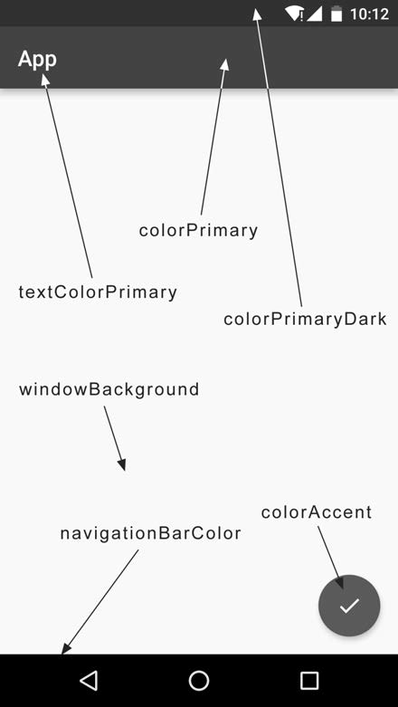

## 什么是 Material Design

Material Design 是由 Google 的设计工程师们基于传统优秀的设计原则，结合丰富的创意和科学技术所发明的一套全新的界面设计语言，包含了视觉、运动、互动效果等特性。

在 2015 年的 Google I/O 大会上推出了一个 Design Support 库，这个库将 Material Design 中最具代表性的一些控件和效果进行了封装，使得开发者即使在不了解 Material Design 的情况下也能非常轻松地将自己的应 Material 化。后来 Design Support 库又改名成了 Material 库，用于给 Google 全平台类的产品提供 Material Design 的支持。

## Toolbar

ActionBar 就是每个 Activity 默认最顶部的那个标题栏，由于设计的原因，被限定只能位于 Activity 的顶部。

Toolbar 继承了 ActionBar 的所有功能，灵活性高，可以配合其他控件完成一些 Material Design 的效果。

不带有 ActionBar  的主题通常有

- `Theme.AppCompat.NoActionBar `

  表示深色主题，界面的主题颜色设成深色，陪衬颜色设成浅色。

- `Theme.AppCompat.Light.NoActionBar`

  表示浅色主题，界面的主题颜色设成浅色，陪衬颜色设成深色。

*/res/values/styles.xml*

```xml
<resources>

    <!-- Base application theme. -->
    <style name="AppTheme" parent="Theme.AppCompat.Light.NoActionBar">
        <!-- Customize your theme here. -->
        <item name="colorPrimary">@color/colorPrimary</item>
        <item name="colorPrimaryDark">@color/colorPrimaryDark</item>
        <item name="colorAccent">@color/colorAccent</item>
    </style>

</resources>
```

各种属性指定颜色的位置。



colorAccent 不只是用来指定这样一个按钮的颜色，而是更多表达了一个强调的意思，比如一些控件的选中状态也会使用 colorAccent 的颜色。

**使用 Toolbar**

```xml
<?xml version="1.0" encoding="utf-8"?>
<FrameLayout xmlns:android="http://schemas.android.com/apk/res/android"
    xmlns:app="http://schemas.android.com/apk/res-auto"
    android:layout_width="match_parent"
    android:layout_height="match_parent">

    <androidx.appcompat.widget.Toolbar
        android:id="@+id/toolbar"
        android:layout_width="match_parent"
        android:layout_height="?attr/actionBarSize"
        android:background="@color/colorPrimary"
        android:theme="@style/ThemeOverlay.AppCompat.Dark.ActionBar"
        app:popupTheme="@style/ThemeOverlay.AppCompat.Light" />
    
</FrameLayout>
```

里使用 `xmlns:app` 指定了一个新的命名空间，许多 Material 属性是在新系统中新增的，为了能够兼容老系统，就不能那个使用 `android:attribute` 这样的写法了，而是应该使用 `app:attribute` 。

将 Toolbar 的高度设置为 actionBar 的高度，背景色设置成了 colorPrimary 。

刚才在 `styles.xml` 中将程序的主题指定成了淡色主题，因此 Toolbar 现在也是淡色主题，而 Toolbar 上面的各种元素就会自动使用深色系，从而和主体颜色区别开。但是之前使用 ActionBar 时文字都是白色的，现在变成黑色的会很难看。

为了能让 Toolbar 单独使用深色主题，这里使用 ` android:theme` 属性，将 Toolbar 的主题指定成了 `ThemeOverlay.AppCompat.Dark.ActionBar` 。使用 `app:popupTheme` 属性单独将弹出的菜单项指定成了淡色主题。

**为 Toolbar 添加 action 按钮**

```xml
<?xml version="1.0" encoding="utf-8"?>
<menu xmlns:android="http://schemas.android.com/apk/res/android"
    xmlns:app="http://schemas.android.com/apk/res-auto">

    <item
        android:id="@+id/backup"
        android:icon="@drawable/ic_backup"
        android:title="@string/backup"
        app:showAsAction="always" />
    <item
        android:id="@+id/delete"
        android:icon="@drawable/ic_delete"
        android:title="@string/delete"
        app:showAsAction="ifRoom" />
    <item
        android:id="@+id/settings"
        android:icon="@drawable/ic_settings"
        android:title="@string/settings"
        app:showAsAction="never" />
</menu>
```

再次使用了 app 命名空间，同样是为了能够兼容低版本的系统。

showAsAction 用来指定按钮的显示位置，主要有一下几种值可选：

- always

  永远显示在 Toolbar 中，如果屏幕空间不够则不显示

- ifRoom

  屏幕空间足够的情况下显示在 Toolbar 中，不够的话就显示在菜单当中

- never

  永远显示在菜单当中

Toolbar 中的 action 按钮只会显示图标，菜单中的 action 按钮只会显示文字。

## 滑动菜单

所谓的滑动菜单，就是将一些菜单选项隐藏起来，而不是放置在主屏幕上，然后可以通过滑动的方式将菜单显示出来。这种方式既节省了屏幕空间，又实现了非常好的动画效果，是 Material Design 中推荐的做法。

AndroidX 库中提供了一个 DrawerLayout 控件。

```xml
<?xml version="1.0" encoding="utf-8"?>
<androidx.drawerlayout.widget.DrawerLayout
    xmlns:android="http://schemas.android.com/apk/res/android"
    xmlns:app="http://schemas.android.com/apk/res-auto"
    android:id="@+id/drawerLayout"
    android:layout_width="match_parent"
    android:layout_height="match_parent">

    <FrameLayout
        android:layout_width="match_parent"
        android:layout_height="match_parent">

        <androidx.appcompat.widget.Toolbar
            android:id="@+id/toolbar"
            android:layout_width="match_parent"
            android:layout_height="?attr/actionBarSize"
            android:background="@color/colorPrimary"
            android:theme="@style/ThemeOverlay.AppCompat.Dark.ActionBar"
            app:popupTheme="@style/ThemeOverlay.AppCompat.Light" />
    </FrameLayout>

    <TextView
        android:layout_width="match_parent"
        android:layout_height="match_parent"
        android:gravity="start"
        android:background="#FFF"
        android:text="@string/this_is_menu"
        android:textSize="30sp" />

</androidx.drawerlayout.widget.DrawerLayout>
```

第二个子控件使用了一个 TextView，用于作为滑动菜单中显示的内容，其实使用什么都可以，DrawerLayout 并没有限制只能使用固定的控件。

第二个子控件 layout_gravity 这个属性是必须指定的，因为需要告诉 DrawerLayout 滑动菜单是在屏幕的左边还是右边，指定 left 表示滑动菜单在左边，指定 right 表示滑动菜单在右边。

指定 start，表示会根据系统语言进行判断，如果系统语言是从左往右的，比如英语、汉语，滑动菜单就在左边，如果系统语言是从右往左的，比如阿拉伯语，滑动菜单就在右边。

```kotlin
override fun onCreate(savedInstanceState: Bundle?) {
    ...
    supportActionBar?.let {
        it.setDisplayHomeAsUpEnabled(true)
        it.setHomeAsUpIndicator(R.drawable.ic_menu)
    }
}

override fun onOptionsItemSelected(item: MenuItem): Boolean {
    when (item.itemId) {
        R.id.home -> drawerLayout.openDrawer(GravityCompat.START)
        ...
    }
    return true
}
```

设置显示导航栏，设置导航按钮图标。实际上，Toolbar 最左侧的这个按钮就叫作 Home 按钮，它默认的图标是一个返回的箭头，含义是返回上一个 Activity 。这里将它默认的样式和作用都进行了修改。

Home 按钮的 id 永远都是 `android.R.id.home`。然后调用 DrawerLayout 的 `openDrawer()` 方法将滑动菜单展示出来，传入一个 Gravity 参数，为了保证这里的行为和 XML 中定义的一致，传入 `GravityCompat.START` 。
