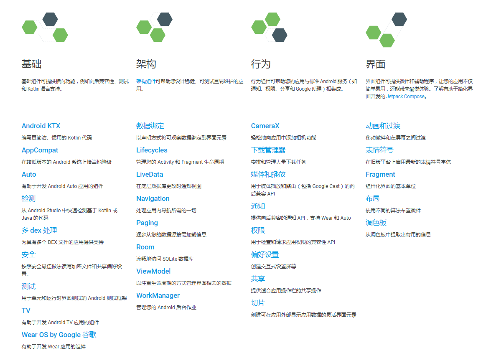

## Jetpack

Jetpack 是一个开发组件工具集，它的主要目的是帮助我们编写更加简洁的代码，并简化我们的开发过程。Jetpack 中的组件有一个特点，它们大部分不依赖于任何 Android 系统版本，这意味着这些组件通常是定义在 AndroidX 库当中的，并且拥有非常好的向下兼容性。



Jetpack 主要由基础、架构、行为、界面这 4 个部分组成。

## ViewModel

传统的开发模式下，Activity 的任务实在是太重了，既要负责逻辑处理，又要控制 UI 展示，还得处理网络回调。

ViewModel 专门用于存放与界面相关的数据，ViewModel 的生命周期和 Activity 不同，在手机屏幕发生旋转的时候不会被重新创建，只有当 Activity 退出的时候才会跟着 Activity 一起销毁。

ViewModel 的生命周期示意图。


### ViewModel 的基本用法

```
implementation "androidx.lifecycle:lifecycle-extensions:2.2.0"
```

模拟一个计数器功能，旋转屏幕不丢失数据。

```kotlin
class MainViewModel : ViewModel() {
    var counter = 0
}

class MainActivity : AppCompatActivity() {

    lateinit var viewModel: MainViewModel

    override fun onCreate(savedInstanceState: Bundle?) {
        super.onCreate(savedInstanceState)
        setContentView(R.layout.activity_main)

        // viewModel = ViewModelProviders.of(this).get(MainViewModel::class.java)
        viewModel =  ViewModelProvider(this).get(MainViewModel::class.java)
        plusOneBtn.setOnClickListener {
            viewModel.counter++
            refreshCounter()
        }
    }

    private fun refreshCounter() {
        infoText.text = viewModel.counter.toString()
    }
}
```

绝对不可以直接创建 ViewModel 的实例，ViewModel 有独立的生命周期，并且长于 Activity。

`ViewModelProviders.of()` 已被废弃。

### 向 ViewModel 传递参数

保证计数器即使在退出程序后又重新打开的情况下，数据仍然不会丢失。

```kotlin
class MainViewModelFactory(private val countReserved: Int) : ViewModelProvider.Factory {
    override fun <T : ViewModel> create(modelClass: Class<T>): T {
        return MainViewModel(countReserved) as T
    }
}

class MainActivity : AppCompatActivity() {

    lateinit var viewModel: MainViewModel
    lateinit var sp: SharedPreferences

    override fun onCreate(savedInstanceState: Bundle?) {
        super.onCreate(savedInstanceState)
        setContentView(R.layout.activity_main)

        sp = getPreferences(Context.MODE_PRIVATE)
        val countReserved = sp.getInt("count_reserved", 0)

        viewModel =  ViewModelProvider(this, MainViewModelFactory(countReserved)).get(MainViewModel::class.java)

        plusOneBtn.setOnClickListener {
            viewModel.counter++
            refreshCounter()
        }

        clearBtn.setOnClickListener {
            viewModel.counter = 0
            refreshCounter()
        }

        refreshCounter()
    }

    override fun onPause() {
        super.onPause()
        sp.edit {
            putInt("count_reserved", viewModel.counter)
        }
    }

    private fun refreshCounter() {
        infoText.text = viewModel.counter.toString()
    }
}
```

在 MainViewModelFactory 中可以创建 ViewModel，`create()` 方法的执行时机和 Activity 的声明周期无关。

## Lifecycles

我们需要时刻感知到 Activity 的生命周期，以便在适当的时侯进行相应的逻辑控制。

在一个非 Activity 的类中去感知 Activity 的生命周期的需求是广泛存在的，同时也衍生出一系列的解决方案，比如通过在 Activity 中嵌入一个隐藏的 Fragment 来进行感知，或者通过手写监听器的方式来感知。

```kotlin
class MyObserver : LifecycleObserver {
    fun activityStart() {
    }

    fun activityStop() {
    }
}

class MainActivity : AppCompatActivity() {
    lateinit var observer: MyObserver
    
    override fun onCreate(savedInstanceState: Bundle?) {
        super.onCreate(savedInstanceState)
        observer = MyObserver()
    }

    override fun onStart() {
        super.onStart()
        observer.activityStart()
    }

    override fun onStop() {
        super.onStop()
        observer.activityStop()
    }
}
```

手写监听器的方式需要在 Activity 中编写大量的逻辑处理。

使用 Lifecycles 组件。

```kotlin
class MyObserver : LifecycleObserver {

    @OnLifecycleEvent(Lifecycle.Event.ON_START)
    fun activityStart() {
        Log.d("MyObserver", "activityStart")
    }

    @OnLifecycleEvent(Lifecycle.Event.ON_STOP)
    fun activityStop() {
        Log.d("MyObserver", "activityStop")
    }

}
```

使用了 `@OnLifecycleEvent` 注解，传入了一种生命周期事件。

生命周期事件的类型一共有 7 中：ON_CREATE、ON_START、ON_RESUME、ON_PAUSE、ON_STOP、ON_DESTROY 分别匹配 Activity 中相应的生命周期回调；另外的一种 ON_ANY 类型表示可以匹配 Activity 的任何生命周期回调。

通过 LifecycleOwner 让 MyObserver 得到通知：

```kotlin
lifecycleOwner.lifecycle.addObserver(MyObserver())
```

只要 Activity 是继承自 AppCompatActivity，或者 Fragment 是继承自 androidx.fragment.app.Fragment 的，那么它们本身就是一个 LifecycleOwner 实例。

```kotlin
override fun onCreate(savedInstanceState: Bundle?) {
    ...
    lifecycle.addObserver(MyObserver())
}
```

主动获知当前的生命周期状态。

```kotlin
class MyObserver(val lifecycle: Lifecycle) : LifecycleObserver {
    ...
}
```

有了 Lifecycle 对象后，可以通过 `lifecycle.currentState` 来主动获知当前的生命周期状态。

返回的声明周期状态是一个枚举类型，一共有五种状态：`INITIALIZED`、`DESTROYED`、`CREATED`、`STARTED`、`RESUMED` 。

Activity 生命周期状态与事件的对应关系。


## LiveData

LiveData 是 Jetpack 提供的一种响应式变成组件，它可以包含任何类型的数据，并在数据发生变的时候通知给它的观察者。LiveData 特别适合与 ViewModel 结合在一起使用。

### LiveData 的基本用法

Activity 中手动获取 ViewModel 中的数据这种交互方式，如果 ViewModel 内部开启了线程去执行一些耗时的逻辑，那么再点击按钮后立即去获取最新的数据，得到的肯定还是之前的数据。

ViewModel 生命周期长于 Activity，如果把 Activity 的实例传给 ViewModel，就很有可能因为 Activity 无法释放而造成内存泄漏。

可以将计数器的计数使用 LiveData 来包装，在 Acitivty 中去观察它。

```kotlin
class MainViewModel(countReserved: Int) : ViewModel() {

    var counter = MutableLiveData<Int>()

    init {
        counter.value = countReserved
    }

    fun plusOne() {
        val count = counter.value ?: 0
        counter.value = count + 1
    }

    fun clear() {
        counter.value = 0
    }

}
```

MutableLiveData 是一种可变的 LiveData。

- `getValue()`
- `setValue()` 只能在主线程调用。
- `postValue()` 用于在非主线程中给 LiveData 设置数据。

```kotlin
plusOneBtn.setOnClickListener {
    viewModel.plusOne()
}

clearBtn.setOnClickListener {
    viewModel.clear()
}

viewModel.counter.observe(this, Observer { count ->
    infoText.text = count.toString()
})
```

任何 LiveData 对象都可以调用它的 `observe()` 方法来观察数据的变化。

第一个参数是 LifecycleOwner 对象；第二个参数是一个 Observer 接口，当 LiveData 中包含数据发生变化时，就会回调这里。

```java
public void observe(LifecycleOwner owner, Observer<? super T> observer) {
    ...
}
```

`observe()` 方法同时接收两个单抽象方法接口参数时，要么同时使用函数式 API 的写法，要么都不用使用函数式 API 的写法。

2019 年的 Google I/O 大会上，Android 团队官宣了 Kotlin First，并且承诺未来会在 Jetpack 中提供更多专门面向 kotlin 语言的 API 。`lifecycle-livedata-ktx` 在 2.2.0 版本中加入了对 `observe()` 方法的语法扩展。

```
implementation "androidx.lifecycle:lifecycle-livedata-ktx:2.2.0"
```

目前对外暴露的是可变的 LiveData，推荐的做法是永远只暴露不可变的 LiveData 给外部。

```kotlin
class MainViewModel(countReserved: Int) : ViewModel() {
    
    val counter : LiveData<Int>
        get() = _counter

    private val _counter = MutableLiveData<Int>()

    init {
        _counter.value = countReserved
    }

    fun plusOne() {
        val count = _counter.value ?: 0
        _counter.value = count + 1
    }

    fun clear() {
        _counter.value = 0
    }

}
```

重新定义 counter 变量，类型为不可变的 LiveData，`get()` 属性方法中返回 _counter 变量。

### map 和 switchMap

**`map()` 方法作用是将实际包含数据的 LiveData 和仅用于观察数据的 LiveData 进行转换。**

```kotlin
data class User(var firstName: String, var lastName: String, val age: Int)

class MainViewModel(countReserved: Int) : ViewModel() {

    private val userLiveData = MutableLiveData<User>()

    val userName: LiveData<String> = Transformations.map(userLiveData) { user ->
        "${user.firstName} ${user.lastName}"
    }
    
    ...
}
```

外部不关心 age，外部使用的时候只要观察 userName 这个 LiveData 就可以了。当 userLiveData 的数据发生变化时，`map()` 方法会监听并转换函数中的逻辑，然后再将转换之后的数据通知给 userName 的观察者。

---

实际开发中，ViewModel 中的 LiveData 对象很可能是调用另外的方法获取的。

```kotlin
object Repository {

    fun getUser(userId: String): LiveData<User> {
        val liveData = MutableLiveData<User>()
        liveData.value = User(userId, userId, 0)
        return liveData
    }
}

class MainViewModel(countReserved: Int) : ViewModel() {

    fun getUser(userId: String): LiveData<User> {
        return Repository.getUser(userId)
    }
    ...
}
```

如果 Activity 中仍然使用 `viewModel.getUser(userId).observe(this, Observer {...}) ` 的方式去观察，他因为 `getUser()` 方法每次调用返回的都是一个新的 LiveData 实例，上述写法会一直观察老的 LiveData 实例。

**`switchMap()` 方法可以将这个 LiveData 对象转换成另一个可观察的 LiveData 对象。**

```kotlin
class MainViewModel(countReserved: Int) : ViewModel() {

    private val userIdLiveData = MutableLiveData<String>()

    val user: LiveData<User> = Transformations.switchMap(userIdLiveData) { userId ->
        Repository.getUser(userId)
    }

    fun getUser(userId: String) {
        userIdLiveData.value = userId
    }
    ...
}
```

userIdLiveData 对象用来观察 userId 的数据变化，然后调用 `switchMap()` 方法，用来对另一个可观察的 LiveData 对象进行转换。

当外部调用 MainViewModel 的 `getUser()` 方法来获取用户数据时，并不会发起任何请求或者函数调用，只会将 userId 值设置到 userIdLiveData 当中。

userIdLiveData 的数据发生变化，观察 userIdLiveData 的 `switchMap()` 方法就会执行，调用转换函数。在转换函数中调用 `Repository.getUser()` 方法获得真正的用户数据，同时 `switchMap()` 方法会将 `Repository.getUser()` 方法返回的 LiveData 对象转换成一个可观察的 LiveData 对象。Activity 观察这个 user 对象就可以了。

```kotlin
getUserBtn.setOnClickListener {
    val userId = (0..10000).random().toString()
    viewModel.getUser(userId)
}
viewModel.user.observe(this, Observer { user ->
    infoText.text = user.toString()
})
```

---

ViewModel 中某个获取数据的方法有可能是没有参数的，在没有可观察数据的情况下，需要创建一个空的 LiveData 对象。

```kotlin
private val refreshLiveData = MutableLiveData<Any?>()

val refreshResult = Transformations.switchMap(refreshLiveData) {
    Repository.getUser("")
}

fun refresh() {
    refreshLiveData.value = refreshLiveData.value
}
```

`refresh()` 方法中只是将 refreshLiveData 原有的数据取出来，再重新设置到 refreshLiveData 当中，这样就能触发一次数据变化。LiveData 内部不会判断即将设置的数据与原有数据是否相同，只要调用了 `setValue()` 或 `postValue()` 方法，就一定会触发变化事件。

Activity 中观察 refreshResult 即可。

## Room

Room 是 Android 官方推出的 ORM 框架，并将它加入了 Jetpack 当中。

### 使用 Room 进行增删改查

Room 主要由 Entity、Dao、Database 这 3 部分组成。

- Entity

  用于定义封装实际数据的实体类，每个实体类都会在数据库中有一张对应的表，并且表中的列是根据具体实体类的字段自动生成的。

- Dao

  Dao 是数据访问对象。通常会在这里对数据库的各项操作进行封装，在实际编程的时候，逻辑层就不需要和底层数据库打交道了，直接和 Dao 层进行交互即可。

- Database 

  用于定义数据库中的关键信息，包括数据库的版本号，包含哪些实体类以及提供 Dao 层的访问实例。

新增 kotlin-kapt 插件和依赖库。

```
apply plugin: 'com.android.application'
apply plugin: 'kotlin-android'
apply plugin: 'kotlin-android-extensions'
apply plugin: 'kotlin-kapt'

dependencies {
    ...
    implementation "androidx.room:room-runtime:2.2.5"
    kapt "androidx.room:room-compiler:2.2.5"
}
```

kapt 只能在 Kotlin 项目中使用，如果是 Java 项目的话，使用 annotationProcessor 即可。

---

```kotlin
@Entity
data class User(var firstName: String, var lastName: String, val age: Int) {

    @PrimaryKey(autoGenerate = true)
    var id: Long = 0
}
```


```kotlin
@Dao
interface UserDao {

    @Insert
    fun insertUser(user: User): Long

    @Update
    fun updateUser(newUser: User)

    @Query("select * from User")
    fun loadAllUsers(): List<User>

    @Query("select * from User where age > :age")
    fun loadUsersOlderThan(age: Int): List<User>

    @Delete
    fun deleteUser(user: User)

    @Query("delete from User where lastName = :lastName")
    fun deleteUserByLastName(lastName: String): Int

}
```

`@Insert` 注解表示会将参数中传入的 User 对象插入数据库中，并且会将自动生成的主键 id 值返回。

`@Insert`、`@Update`、`@Delete` 不用编写 SQL 语句。

Room 支持编译时动态检查 SQL 语句语法。


Database 写法是非常固定的，只需要定义好 3 个部分的内容：数据库的版本号、包含哪些实体类，以及提供 Dao 层的访问实例。

```kotlin
@Database(version = 1, entities = [User::class])
abstract class AppDatabase : RoomDatabase() {

    abstract fun userDao(): UserDao
    
    companion object {

        private var instance: AppDatabase? = null

        @Synchronized
        fun getDatabase(context: Context): AppDatabase {
            instance?.let {
                return it
            }
            return Room.databaseBuilder(context.applicationContext, AppDatabase::class.java, "app_database")
                .build().apply {
                instance = this
            }
        }
    }

}
```

AppDatabase 类必须继承自 RoomDatabase 类，并且一定要使用 abstract 关键字将它声明成抽象类，并且提供相应的抽象方法，用于获取之前编写的 Dao 的实例。

在 companion object 结构体中编写一个单例模式，使用 instance 变量来缓存 AppDatabase 实例。

`databaseBuilder()` 方法接收 3 个参数，第一个参数一定要使用 applicationContext，不能使用普通的 context，否则容易出现内存泄漏的情况。

```kotlin
val userDao = AppDatabase.getDatabase(this).userDao()
val user1 = User("Tom", "Brady", 40)
val user2 = User("Tom", "Hanks", 63)
addDataBtn.setOnClickListener {
    thread {
        user1.id = userDao.insertUser(user1)
        user2.id = userDao.insertUser(user2)
    }
}
updateDataBtn.setOnClickListener {
    thread {
        user1.age = 42
        userDao.updateUser(user1)
    }
}
deleteDataBtn.setOnClickListener {
    thread {
        userDao.deleteUserByLastName("Hanks")
    }
}
queryDataBtn.setOnClickListener {
    thread {
        for (user in userDao.loadAllUsers()) {
            Log.d("MainActivity", user.toString())
        }
    }
}
```

由于数据库操作属于耗时操作，Room 默认是不允许在主线程中进行数据库操作的。

为了方便测试，Room还提供了更加简单的方法用于允许在主线程中进行数据库操作。创建实例时加入 `allowMainThreadQueries()` 方法，这个方法建议只在测试环境下使用。

```kotlin
Room.databaseBuilder(context.applicationContext, AppDatabase::class.java, "app_database")
    .allowMainThreadQueries()
    .build()
```

### Room 的数据库升级

如果目前只是在开发测试阶段，不想编写繁琐的数据库升级逻辑，在构建实例时加入 `fallbackToDestructiveMigration()` 方法，这样只要数据库进行了升级，Room 就会将当前的数据库销毁，然后再重现创建，之前数据库中的所有数据也就全部丢失了。

---

新增实体类的情况。

```kotlin
@Entity
data class Book(var name: String, var pages: Int) {

    @PrimaryKey(autoGenerate = true)
    var id = 0L

}

@Dao
interface BookDao {

    @Insert
    fun insertBook(book: Book): Long

    @Query("select * from Book")
    fun loadAllBooks(): List<Book>

}

@Database(version = 2, entities = [User::class, Book::class])
abstract class AppDatabase : RoomDatabase() {

    abstract fun userDao(): UserDao

    abstract fun bookDao(): BookDao

    companion object {

        private val MIGRATION_1_2 = object : Migration(1, 2) {
            override fun migrate(database: SupportSQLiteDatabase) {
                database.execSQL("create table Book (id integer primary key autoincrement not null, name text not null, pages integer not null)")
            }
        }


        private var instance: AppDatabase? = null

        @Synchronized
        fun getDatabase(context: Context): AppDatabase {
            instance?.let {
                return it
            }
            return Room.databaseBuilder(context.applicationContext, AppDatabase::class.java, "app_database")
                .addMigrations(MIGRATION_1_2)
                .build().apply {
                instance = this
            }
        }
    }

}
```

version 升级成了 2，entities 中加入了 Book，提供了 `bookDao()` 方法用于获取 BookDao 实例。

companion object 结构体中实现了一个 Migration 的匿名类，传入的 1 和 2 表示当数据库版本从 1 升级到 2 的时候就执行这个匿名类中的升级逻辑。命名为 MIGRATION_1_2 可读性更高。

最后在构建 AppDatabase 实例时，加入一个 `addMigrations()` 方法，并把 MIGRATION_1_2 传入即可。

---

添加一列的情况。

```kotlin
@Entity
data class Book(var name: String, var pages: Int, var author: String) {

    @PrimaryKey(autoGenerate = true)
    var id = 0L

}

@Database(version = 3, entities = [User::class, Book::class])
abstract class AppDatabase : RoomDatabase() {

    abstract fun userDao(): UserDao

    abstract fun bookDao(): BookDao

    companion object {

        private val MIGRATION_1_2 = object : Migration(1, 2) {
            override fun migrate(database: SupportSQLiteDatabase) {
                database.execSQL("create table Book (id integer primary key autoincrement not null, name text not null, pages integer not null)")
            }
        }

        private val MIGRATION_2_3 = object : Migration(2, 3) {
            override fun migrate(database: SupportSQLiteDatabase) {
                database.execSQL("alter table Book add column author text not null default 'unknown'")
            }
        }

        private var instance: AppDatabase? = null

        @Synchronized
        fun getDatabase(context: Context): AppDatabase {
            instance?.let {
                return it
            }
            return Room.databaseBuilder(context.applicationContext, AppDatabase::class.java, "app_database")
                .addMigrations(MIGRATION_1_2, MIGRATION_2_3)
                .build().apply {
                instance = this
            }
        }
    }

}
```

## WorkManager

基本上 Android 系统每发布一个新版本，后台权限都会被进一步收紧。

从 4.4 系统开始 AlarmManager 的触发时间由原来的精准变为不精准；

5.0 系统中加入了 JobScheduler 来处理后台任务；

6.0 系统中引入了 Doze 和 App Standby 模式用于降低手机被后台唤醒的频率；

从 8.0 系统开始直接禁用了 Service 的后台功能，只允许使用前台 Service。


Google 退出了 WorkManager 组件用于处理一些要求定时执行的任务，它可以根据操作系统的版本自动选择底层是使用 AlarmManager 还是 JobScheduler 实现，从而降低使用成本。另外还支持周期性任务、链式任务处理等功能。WorkManager 可以保证即使在应用退出甚至手机重启的情况下，之前注册的任务仍然会得到执行。

另外，使用 WorkManager 注册的周期性任务不能保证一定会准时执行，系统为了减少电量消耗，可能会将触发时间接近的几个任务放在一起执行，这样可以大幅度地减少 CPU 被唤醒的次数，从而有效延长电池的使用时间。

### WorkManager 的基本用法

```
implementation "androidx.work:work-runtime:2.3.4"
```

WorkManager 的基本用法主要分为以下 3 步：

- 定义一个后台任务，并实现具体的任务逻辑。
- 配置该后台任务的运行条件和约束信息，并构建后台任务请求。
- 将该后台任务请求传入 WorkManager 的 `enqueue()` 方法中，系统会在合适的时间运行。

---

**第一步**

```kotlin
class SimpleWorker(context: Context, params: WorkerParameters) : Worker(context, params) {

    override fun doWork(): Result {
        Log.d("SimpleWorker", "do work in SimpleWorker")
        return Result.success()
    }

}
```

每一个后台任务都必须继承自 Worker 类，并调用它唯一的构造函数。然后重写父类的 `doWork()` 方法，在其中编写具体的后台任务逻辑。

`doWork()` 方法不会运行在主线程中，要求返回一个 Result 对象，用于表示任务的运行结果。成功就返回 `Result.success()`，失败就返回 `Result.failure()`。`Result.retry()` 也代表着失败，但是可以结合 `WorkRequest.Builder` 的 `setBackoffCriteria()` 方法来重新执行任务。

**第二步**

最基本的配置：

````kotlin
val request = OneTimeWorkRequest.Builder(SimpleWorker::class.java).build()
````

`OneTimeWorkRequest.Builder` 是 `WorkRequest.Builder` 的子类，用于构建单次运行的后台任务请求。`WorkRequest.Builder` 还有一个子类 `PeriodicWorkRequest.Builder` 可用于构建周期性任务的后台请求，但是为了降低设备性能消耗，运行周期间隔不能短于 15 分钟：

```kotlin
val request = PeriodicWorkRequest.Builder(SimpleWorker::class.java, 15, TimeUnit.MINUTES).build()
```

**第三步**

```kotlin
WorkManager.getInstance(this).enqueue(request)
```

### 使用 WorkManager 处理复杂的任务

让后台任务**在指定的延迟时间后运行**，使用 `setInitialDelay()` 方法：

```kotlin
val request = OneTimeWorkRequest.Builder(SimpleWorker::class.java)
    .setInitialDelay(5, TimeUnit.MINUTES)
    .build()
```

给后台任务请求**添加标签**：

```kotlin
val request = OneTimeWorkRequest.Builder(SimpleWorker::class.java)
    ...
    .addTag("simple")
    .build()
```

**通过标签取消后台任务请求**：

```kotlin
WorkManager.getInstance(this).cancelAllWorkByTag("simple")
```

**通过 id 取消后台任务请求**：

```kotlin
WorkManager.getInstance(this).cancelWorkById(request.id)
```

**一次性取消所有后台任务请求**：

```kotlin
WorkManager.getInstance(this).cancelAllWork()
```

**重新执行任务**：

```kotlin
val request = OneTimeWorkRequest.Builder(SimpleWorker::class.java)
    ...
    .setBackoffCriteria(BackoffPolicy.LINEAR, 10, TimeUnit.MINUTES)
    .build()
```

第一个参数用于指定如果任务再次执行失败，下次重试应该以什么样的形式延迟。LINEAR 代表下次重试时间以线性的方式延迟；EXPONENTIAL 代表下次重试时间以指数的方式延迟。

第二个和第三个参数用于指定在多久之后重新执行任务，时间最短不能少于 10 秒钟。

**监听后台任务的运行结果**：

```kotlin
WorkManager.getInstance(this).getWorkInfoByIdLiveData(request.id)
    .observe(this, Observer { workInfo ->
        if (workInfo.state == WorkInfo.State.SUCCEEDED) {
            Log.d("MainActivity", "do work succeeded")
        } else if (workInfo.state == WorkInfo.State.FAILED) {
            Log.d("MainActivity", "do work failed")
        }
    })
```

监听 `getWorkInfoByIdLiveData()` 返回的 LiveData 对象。也可以调用 `getWorkInfosByTagLiveData()` 监听同一标签名下所有的后台任务请求的运行结果。

**链式任务**

假设定了 3 个独立的后台任务：同步数据、压缩数据和上传数据。现在实现先同步、再压缩、最后上传的功能。

```kotlin
val sync = ...
val compress = ...
val upload = ...
WorkManager.getInstance(this)
    .beginWith(sync)
    .then(compress)
    .then(upload)
    .enqueue()
```

通过 `beginWith()` 方法开启一个链式任务，在前一个后台任务运行成功之后，下一个后台任务才会运行。

---

WorkManager 可以用，但是不要依赖它去实现什么核心功能，因为在国产手机上可能会非常不稳定。

国产 ROM 绝大多数在进行 Android 系统定制的时候大多数会增加一个键关闭的功能，允许用户一键杀死所有非白名单的应用程序。被杀死的应用程序即无法接收广播，也无法运行 WorkManager 的后台任务。


