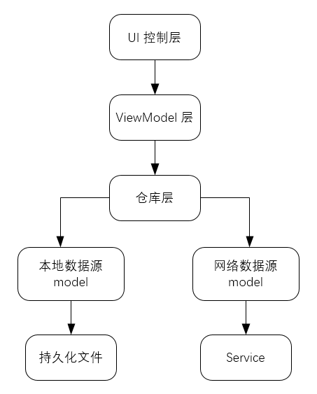
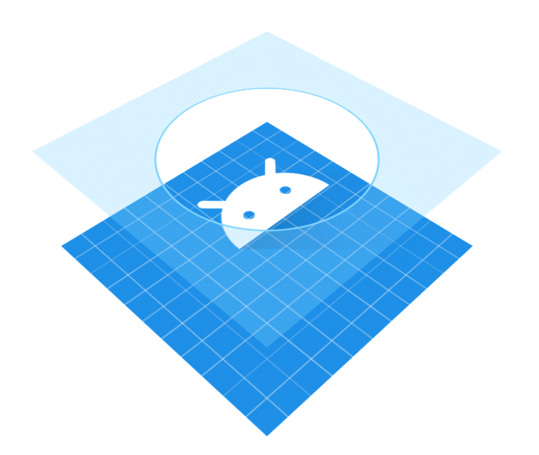
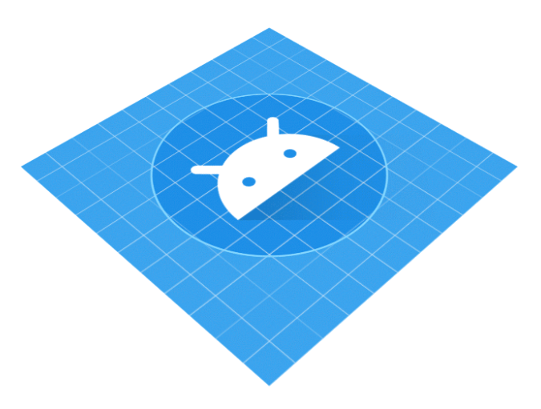
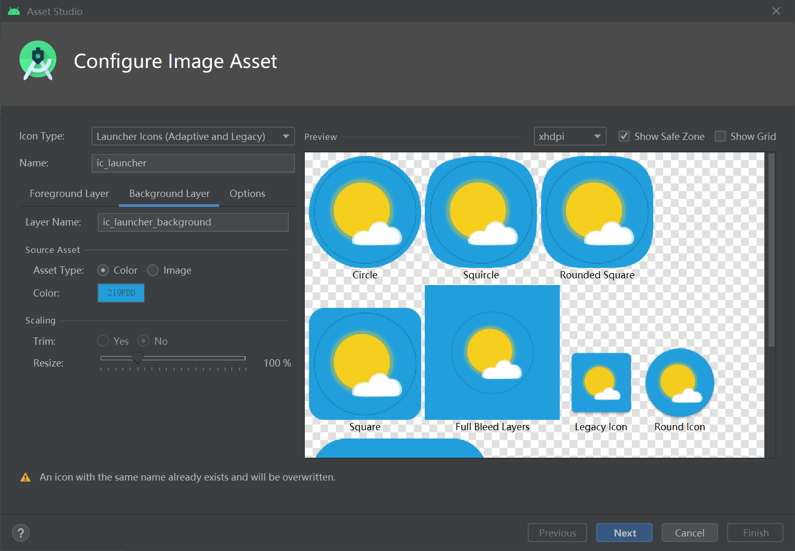
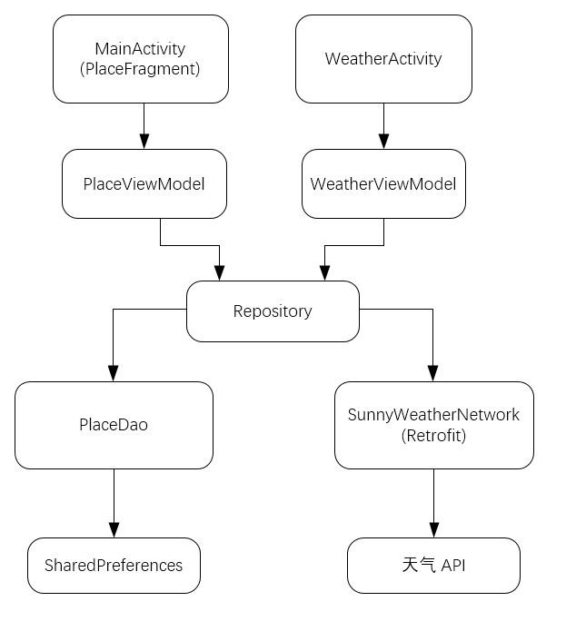

## 功能需求及技术可行性分析

- 可以搜搜全球大多数国家的各个城市数据
- 可以查看全球绝大多数城市的天气信息
- 可以自由地切换城市，查看其他城市的天气
- 可以手动刷新实时的天气

使用彩云天气的 API 。

```
https://api.caiyunapp.com/v2/place?query=北京&token={token}&lang=zh_CN
https://api.caiyunapp.com/v2.5/{token}/116.353063,39.944876/realtime.json
https://api.caiyunapp.com/v2.5/{token}/116.353063,39.944876/daily.json
```

```json
{
    "status": "ok",
    "query": "北京",
    "places": [
        {
            "id": "6e8861ded5d03c5fdfe7a56526af08ecb433a575",
            "location": {
                "lat": 39.9041999,
                "lng": 116.4073963
            },
            "place_id": "g-6e8861ded5d03c5fdfe7a56526af08ecb433a575",
            "name": "北京市",
            "formatted_address": "中国北京市"
        },
        {
            "id": "B000A83C36",
            "name": "北京站",
            "formatted_address": "中国 北京市 东城区 毛家湾胡同甲13号",
            "location": {
                "lat": 39.902779,
                "lng": 116.427694
            },
            "place_id": "a-B000A83C36"
        },
        {
            "id": "B000A83M61",
            "name": "北京西站",
            "formatted_address": "中国 北京市 丰台区 莲花池东路118号",
            "location": {
                "lat": 39.89491,
                "lng": 116.322056
            },
            "place_id": "a-B000A83M61"
        },
        {
            "id": "B000A350CB",
            "name": "北京东站",
            "formatted_address": "中国 北京市 朝阳区 百子湾路7号",
            "location": {
                "lat": 39.90242,
                "lng": 116.485079
            },
            "place_id": "a-B000A350CB"
        },
        {
            "id": "B000A833V8",
            "name": "北京北站",
            "formatted_address": "中国 北京市 西城区 北滨河路1号",
            "location": {
                "lat": 39.944876,
                "lng": 116.353063
            },
            "place_id": "a-B000A833V8"
        }
    ]
}
```

```json
{
    "status": "ok",
    "api_version": "v2.5",
    "api_status": "active",
    "lang": "zh_CN",
    "unit": "metric",
    "tzshift": 28800,
    "timezone": "Asia/Shanghai",
    "server_time": 1588044624,
    "location": [
        39.944876,
        116.353063
    ],
    "result": {
        "realtime": {
            "status": "ok",
            "temperature": 22.79,
            "humidity": 0.31,
            "cloudrate": 0,
            "skycon": "CLEAR_DAY",
            "visibility": 9.8,
            "dswrf": 730,
            "wind": {
                "speed": 12.24,
                "direction": 173
            },
            "pressure": 100652.86,
            "apparent_temperature": 20.5,
            "precipitation": {
                "local": {
                    "status": "ok",
                    "datasource": "radar",
                    "intensity": 0
                },
                "nearest": {
                    "status": "ok",
                    "distance": 10000,
                    "intensity": 0
                }
            },
            "air_quality": {
                "pm25": 67,
                "pm10": 89,
                "o3": 158,
                "so2": 5,
                "no2": 51,
                "co": 0.7,
                "aqi": {
                    "chn": 90,
                    "usa": 157
                },
                "description": {
                    "chn": "良",
                    "usa": "中度污染"
                }
            },
            "life_index": {
                "ultraviolet": {
                    "index": 10,
                    "desc": "很强"
                },
                "comfort": {
                    "index": 5,
                    "desc": "舒适"
                }
            }
        },
        "primary": 0
    }
}
```

```json
{
    "status": "ok",
    "api_version": "v2.5",
    "api_status": "active",
    "lang": "zh_CN",
    "unit": "metric",
    "tzshift": 28800,
    "timezone": "Asia/Shanghai",
    "server_time": 1588044690,
    "location": [
        39.944876,
        116.353063
    ],
    "result": {
        "daily": {
            "status": "ok",
            "astro": [
                {
                    "date": "2020-04-28T00:00+08:00",
                    "sunrise": {
                        "time": "05:18"
                    },
                    "sunset": {
                        "time": "19:06"
                    }
                },
                {
                    "date": "2020-04-29T00:00+08:00",
                    "sunrise": {
                        "time": "05:16"
                    },
                    "sunset": {
                        "time": "19:07"
                    }
                },
                {
                    "date": "2020-04-30T00:00+08:00",
                    "sunrise": {
                        "time": "05:15"
                    },
                    "sunset": {
                        "time": "19:08"
                    }
                },
                {
                    "date": "2020-05-01T00:00+08:00",
                    "sunrise": {
                        "time": "05:14"
                    },
                    "sunset": {
                        "time": "19:09"
                    }
                },
                {
                    "date": "2020-05-02T00:00+08:00",
                    "sunrise": {
                        "time": "05:13"
                    },
                    "sunset": {
                        "time": "19:10"
                    }
                }
            ],
            "precipitation": [
                {
                    "date": "2020-04-28T00:00+08:00",
                    "max": 0,
                    "min": 0,
                    "avg": 0
                },
                {
                    "date": "2020-04-29T00:00+08:00",
                    "max": 0,
                    "min": 0,
                    "avg": 0
                },
                {
                    "date": "2020-04-30T00:00+08:00",
                    "max": 0,
                    "min": 0,
                    "avg": 0
                },
                {
                    "date": "2020-05-01T00:00+08:00",
                    "max": 0,
                    "min": 0,
                    "avg": 0
                },
                {
                    "date": "2020-05-02T00:00+08:00",
                    "max": 0.3245,
                    "min": 0,
                    "avg": 0.0223
                }
            ],
            "temperature": [
                {
                    "date": "2020-04-28T00:00+08:00",
                    "max": 30,
                    "min": 12,
                    "avg": 25.84
                },
                {
                    "date": "2020-04-29T00:00+08:00",
                    "max": 32,
                    "min": 17,
                    "avg": 24.61
                },
                {
                    "date": "2020-04-30T00:00+08:00",
                    "max": 31,
                    "min": 14,
                    "avg": 23.46
                },
                {
                    "date": "2020-05-01T00:00+08:00",
                    "max": 32,
                    "min": 19,
                    "avg": 26.16
                },
                {
                    "date": "2020-05-02T00:00+08:00",
                    "max": 33,
                    "min": 21,
                    "avg": 27.67
                }
            ],
            "wind": [
                {
                    "date": "2020-04-28T00:00+08:00",
                    "max": {
                        "speed": 24.7,
                        "direction": 207.45
                    },
                    "min": {
                        "speed": 0.21,
                        "direction": 72.6
                    },
                    "avg": {
                        "speed": 9.16,
                        "direction": 206.22
                    }
                },
                {
                    "date": "2020-04-29T00:00+08:00",
                    "max": {
                        "speed": 23.98,
                        "direction": 209.53
                    },
                    "min": {
                        "speed": 4.26,
                        "direction": 206.95
                    },
                    "avg": {
                        "speed": 13.9,
                        "direction": 208.42
                    }
                },
                {
                    "date": "2020-04-30T00:00+08:00",
                    "max": {
                        "speed": 18.88,
                        "direction": 211.21
                    },
                    "min": {
                        "speed": 1.3,
                        "direction": 311.89
                    },
                    "avg": {
                        "speed": 9.11,
                        "direction": 208.56
                    }
                },
                {
                    "date": "2020-05-01T00:00+08:00",
                    "max": {
                        "speed": 17.99,
                        "direction": 207.74
                    },
                    "min": {
                        "speed": 0.5,
                        "direction": 278.72
                    },
                    "avg": {
                        "speed": 8.55,
                        "direction": 193.83
                    }
                },
                {
                    "date": "2020-05-02T00:00+08:00",
                    "max": {
                        "speed": 25.04,
                        "direction": 181.56
                    },
                    "min": {
                        "speed": 5.21,
                        "direction": 145.35
                    },
                    "avg": {
                        "speed": 14.1,
                        "direction": 180.89
                    }
                }
            ],
            "humidity": [
                {
                    "date": "2020-04-28T00:00+08:00",
                    "max": 0.27,
                    "min": 0.08,
                    "avg": 0.13
                },
                {
                    "date": "2020-04-29T00:00+08:00",
                    "max": 0.31,
                    "min": 0.1,
                    "avg": 0.19
                },
                {
                    "date": "2020-04-30T00:00+08:00",
                    "max": 0.33,
                    "min": 0.07,
                    "avg": 0.17
                },
                {
                    "date": "2020-05-01T00:00+08:00",
                    "max": 0.24,
                    "min": 0.07,
                    "avg": 0.14
                },
                {
                    "date": "2020-05-02T00:00+08:00",
                    "max": 0.45,
                    "min": 0.17,
                    "avg": 0.3
                }
            ],
            "cloudrate": [
                {
                    "date": "2020-04-28T00:00+08:00",
                    "max": 0,
                    "min": 0,
                    "avg": 0
                },
                {
                    "date": "2020-04-29T00:00+08:00",
                    "max": 0.95,
                    "min": 0,
                    "avg": 0.21
                },
                {
                    "date": "2020-04-30T00:00+08:00",
                    "max": 0.96,
                    "min": 0,
                    "avg": 0.2
                },
                {
                    "date": "2020-05-01T00:00+08:00",
                    "max": 0,
                    "min": 0,
                    "avg": 0
                },
                {
                    "date": "2020-05-02T00:00+08:00",
                    "max": 1,
                    "min": 0.03,
                    "avg": 0.44
                }
            ],
            "pressure": [
                {
                    "date": "2020-04-28T00:00+08:00",
                    "max": 101032.3,
                    "min": 99945.69,
                    "avg": 100146.39
                },
                {
                    "date": "2020-04-29T00:00+08:00",
                    "max": 100139.24,
                    "min": 99512.3,
                    "avg": 99898.08
                },
                {
                    "date": "2020-04-30T00:00+08:00",
                    "max": 99899.24,
                    "min": 99283.29,
                    "avg": 99619.78
                },
                {
                    "date": "2020-05-01T00:00+08:00",
                    "max": 99556.84,
                    "min": 98963.29,
                    "avg": 99330.02
                },
                {
                    "date": "2020-05-02T00:00+08:00",
                    "max": 99659.24,
                    "min": 99019.24,
                    "avg": 99328.44
                }
            ],
            "visibility": [
                {
                    "date": "2020-04-28T00:00+08:00",
                    "max": 24.13,
                    "min": 8.86,
                    "avg": 9.8
                },
                {
                    "date": "2020-04-29T00:00+08:00",
                    "max": 21.04,
                    "min": 11.22,
                    "avg": 14.12
                },
                {
                    "date": "2020-04-30T00:00+08:00",
                    "max": 33.67,
                    "min": 16.84,
                    "avg": 21.64
                },
                {
                    "date": "2020-05-01T00:00+08:00",
                    "max": 33.67,
                    "min": 21.04,
                    "avg": 25.74
                },
                {
                    "date": "2020-05-02T00:00+08:00",
                    "max": 33.67,
                    "min": 15.3,
                    "avg": 25.05
                }
            ],
            "dswrf": [
                {
                    "date": "2020-04-28T00:00+08:00",
                    "max": 834.7,
                    "min": 0,
                    "avg": 511.7
                },
                {
                    "date": "2020-04-29T00:00+08:00",
                    "max": 812.3,
                    "min": 0,
                    "avg": 325.3
                },
                {
                    "date": "2020-04-30T00:00+08:00",
                    "max": 824,
                    "min": 0,
                    "avg": 331.8
                },
                {
                    "date": "2020-05-01T00:00+08:00",
                    "max": 828.7,
                    "min": 0,
                    "avg": 333.5
                },
                {
                    "date": "2020-05-02T00:00+08:00",
                    "max": 782.4,
                    "min": 0,
                    "avg": 310.5
                }
            ],
            "air_quality": {
                "aqi": [
                    {
                        "date": "2020-04-28T00:00+08:00",
                        "max": {
                            "chn": 99,
                            "usa": 99
                        },
                        "avg": {
                            "chn": 86.85,
                            "usa": 86.85
                        },
                        "min": {
                            "chn": 65,
                            "usa": 65
                        }
                    },
                    {
                        "date": "2020-04-29T00:00+08:00",
                        "max": {
                            "chn": 81,
                            "usa": 81
                        },
                        "avg": {
                            "chn": 74.83,
                            "usa": 74.83
                        },
                        "min": {
                            "chn": 64,
                            "usa": 64
                        }
                    },
                    {
                        "date": "2020-04-30T00:00+08:00",
                        "max": {
                            "chn": 69,
                            "usa": 69
                        },
                        "avg": {
                            "chn": 63.75,
                            "usa": 63.75
                        },
                        "min": {
                            "chn": 56,
                            "usa": 56
                        }
                    },
                    {
                        "date": "2020-05-01T00:00+08:00",
                        "max": {
                            "chn": 64,
                            "usa": 64
                        },
                        "avg": {
                            "chn": 59.83,
                            "usa": 59.83
                        },
                        "min": {
                            "chn": 52,
                            "usa": 52
                        }
                    },
                    {
                        "date": "2020-05-02T00:00+08:00",
                        "max": {
                            "chn": 71,
                            "usa": 71
                        },
                        "avg": {
                            "chn": 60.75,
                            "usa": 60.75
                        },
                        "min": {
                            "chn": 50,
                            "usa": 50
                        }
                    }
                ],
                "pm25": [
                    {
                        "date": "2020-04-28T00:00+08:00",
                        "max": 74,
                        "avg": 64.62,
                        "min": 44
                    },
                    {
                        "date": "2020-04-29T00:00+08:00",
                        "max": 60,
                        "avg": 54.96,
                        "min": 46
                    },
                    {
                        "date": "2020-04-30T00:00+08:00",
                        "max": 50,
                        "avg": 46.12,
                        "min": 40
                    },
                    {
                        "date": "2020-05-01T00:00+08:00",
                        "max": 46,
                        "avg": 43,
                        "min": 37
                    },
                    {
                        "date": "2020-05-02T00:00+08:00",
                        "max": 52,
                        "avg": 43.67,
                        "min": 35
                    }
                ]
            },
            "skycon": [
                {
                    "date": "2020-04-28T00:00+08:00",
                    "value": "CLEAR_DAY"
                },
                {
                    "date": "2020-04-29T00:00+08:00",
                    "value": "PARTLY_CLOUDY_DAY"
                },
                {
                    "date": "2020-04-30T00:00+08:00",
                    "value": "CLEAR_DAY"
                },
                {
                    "date": "2020-05-01T00:00+08:00",
                    "value": "CLEAR_DAY"
                },
                {
                    "date": "2020-05-02T00:00+08:00",
                    "value": "PARTLY_CLOUDY_DAY"
                }
            ],
            "skycon_08h_20h": [
                {
                    "date": "2020-04-28T00:00+08:00",
                    "value": "CLEAR_DAY"
                },
                {
                    "date": "2020-04-29T00:00+08:00",
                    "value": "CLEAR_DAY"
                },
                {
                    "date": "2020-04-30T00:00+08:00",
                    "value": "CLEAR_DAY"
                },
                {
                    "date": "2020-05-01T00:00+08:00",
                    "value": "CLEAR_DAY"
                },
                {
                    "date": "2020-05-02T00:00+08:00",
                    "value": "PARTLY_CLOUDY_DAY"
                }
            ],
            "skycon_20h_32h": [
                {
                    "date": "2020-04-28T00:00+08:00",
                    "value": "CLEAR_NIGHT"
                },
                {
                    "date": "2020-04-29T00:00+08:00",
                    "value": "PARTLY_CLOUDY_NIGHT"
                },
                {
                    "date": "2020-04-30T00:00+08:00",
                    "value": "CLEAR_NIGHT"
                },
                {
                    "date": "2020-05-01T00:00+08:00",
                    "value": "CLEAR_NIGHT"
                },
                {
                    "date": "2020-05-02T00:00+08:00",
                    "value": "LIGHT_RAIN"
                }
            ],
            "life_index": {
                "ultraviolet": [
                    {
                        "date": "2020-04-28T00:00+08:00",
                        "index": "4",
                        "desc": "强"
                    },
                    {
                        "date": "2020-04-29T00:00+08:00",
                        "index": "3",
                        "desc": "中等"
                    },
                    {
                        "date": "2020-04-30T00:00+08:00",
                        "index": "4",
                        "desc": "强"
                    },
                    {
                        "date": "2020-05-01T00:00+08:00",
                        "index": "4",
                        "desc": "强"
                    },
                    {
                        "date": "2020-05-02T00:00+08:00",
                        "index": "2",
                        "desc": "弱"
                    }
                ],
                "carWashing": [
                    {
                        "date": "2020-04-28T00:00+08:00",
                        "index": "2",
                        "desc": "较适宜"
                    },
                    {
                        "date": "2020-04-29T00:00+08:00",
                        "index": "2",
                        "desc": "较适宜"
                    },
                    {
                        "date": "2020-04-30T00:00+08:00",
                        "index": "1",
                        "desc": "适宜"
                    },
                    {
                        "date": "2020-05-01T00:00+08:00",
                        "index": "3",
                        "desc": "较不适宜"
                    },
                    {
                        "date": "2020-05-02T00:00+08:00",
                        "index": "3",
                        "desc": "较不适宜"
                    }
                ],
                "dressing": [
                    {
                        "date": "2020-04-28T00:00+08:00",
                        "index": "3",
                        "desc": "热"
                    },
                    {
                        "date": "2020-04-29T00:00+08:00",
                        "index": "3",
                        "desc": "热"
                    },
                    {
                        "date": "2020-04-30T00:00+08:00",
                        "index": "3",
                        "desc": "热"
                    },
                    {
                        "date": "2020-05-01T00:00+08:00",
                        "index": "2",
                        "desc": "很热"
                    },
                    {
                        "date": "2020-05-02T00:00+08:00",
                        "index": "2",
                        "desc": "很热"
                    }
                ],
                "comfort": [
                    {
                        "date": "2020-04-28T00:00+08:00",
                        "index": "4",
                        "desc": "温暖"
                    },
                    {
                        "date": "2020-04-29T00:00+08:00",
                        "index": "4",
                        "desc": "温暖"
                    },
                    {
                        "date": "2020-04-30T00:00+08:00",
                        "index": "4",
                        "desc": "温暖"
                    },
                    {
                        "date": "2020-05-01T00:00+08:00",
                        "index": "4",
                        "desc": "温暖"
                    },
                    {
                        "date": "2020-05-02T00:00+08:00",
                        "index": "3",
                        "desc": "热"
                    }
                ],
                "coldRisk": [
                    {
                        "date": "2020-04-28T00:00+08:00",
                        "index": "4",
                        "desc": "极易发"
                    },
                    {
                        "date": "2020-04-29T00:00+08:00",
                        "index": "4",
                        "desc": "极易发"
                    },
                    {
                        "date": "2020-04-30T00:00+08:00",
                        "index": "4",
                        "desc": "极易发"
                    },
                    {
                        "date": "2020-05-01T00:00+08:00",
                        "index": "4",
                        "desc": "极易发"
                    },
                    {
                        "date": "2020-05-02T00:00+08:00",
                        "index": "4",
                        "desc": "极易发"
                    }
                ]
            }
        },
        "primary": 0
    }
}
```


## 搭建 MVVM 项目架构

MVVM（Model–View–ViewModel）是一种高级项目架构模式，目前已经广泛应用在 Android 程序设计领域，类似的架构模式还有 MVP、MVC 等。

简单说来讲，MVVM 架构可以将程序结构主要分为 3 部分：

- Model

  数据模型部分

- View

  界面展示部分

- ViewModel

  可以理解成一个连杰数据模型和界面展示的桥梁，从而实现让业务逻辑和界面展示分离的程序结构设计

MVVM 项目架构示意图。



UI 控制层包含平时所写的 Activity、Fragment、布局文件等于界面相关的东西。

ViewModel 层持有和 UI 元素相关的数据，以保证这些数据在屏幕旋转时不会丢失，并且还要提供接口给 UI 控制层调用以及和仓库层进行通信。

仓库层主要工作是判断调用方请求的数据应该是从本地数据源中获取还是从网络数据源中获取，并将获取到的数据返回给调用方。本地数据源可以使用数据库、SharedPreferences 等持久化技术来实现，而网络数据源则使用 Retrofit 访问服务器提供的接口来实现。

所有箭头都是单向的，谨记每一层组件都只能与它相邻的组件进行交互。

---

**包结构**

```
com
  └─homurax
      └─sunnyweather
          │  MainActivity.kt
          │
          ├─logic
          │  ├─dao
          │  ├─model
          │  └─network
          └─ui
              ├─place
              └─weather
```

- logic：业务逻辑相关的代码
  - dao：数据访问对象
  - model：对象模型
  - network：网络相关的代码

- ui：界面展示相关的代码
  - place、weather：两个主要界面

---

**依赖库**

```
/* RecyclerView */
implementation 'androidx.recyclerview:recyclerview:1.1.0'
/* Lifecycle */
implementation "androidx.lifecycle:lifecycle-extensions:2.2.0"
implementation "androidx.lifecycle:lifecycle-viewmodel-ktx:2.2.0"
implementation "androidx.lifecycle:lifecycle-livedata-ktx:2.2.0"
/* WorkManager */
implementation "androidx.work:work-runtime:2.3.4"
/* Material */
implementation 'com.google.android.material:material:1.1.0'
/* Retrofit */
implementation 'com.squareup.retrofit2:retrofit:2.8.1'
implementation 'com.squareup.retrofit2:converter-gson:2.8.1'
/* 协程 */
implementation "org.jetbrains.kotlinx:kotlinx-coroutines-core:1.3.5"
implementation "org.jetbrains.kotlinx:kotlinx-coroutines-android:1.3.5"
```

## 搜索全球城市数据

搜索具体城市数据 → 获取该地区的经纬度坐标。

### 实现逻辑层代码

ViewModel 不持有 Activity 的引用了，需要提供全局获取 Context 的方式。

***SunnyWeatherApplication***

```kotlin
class SunnyWeatherApplication : Application() {

    companion object {
        // 彩云天气 API token
        const val TOKEN = "..."
        @SuppressLint("StaticFieldLeak")
        lateinit var context: Context
    }

    override fun onCreate() {
        super.onCreate()
        context = applicationContext
    }
}
```

***PlaceResponse.kt***

```kotlin
class Location(val lng: String, val lat: String)

class Place(val name: String, val location: Location,
            @SerializedName("formatted_address") val address: String)

class PlaceResponse(val status: String, val places: List<Place>)
```

JSON 中一些字段和 Kotlin 字段命名不一致，通过 `@SerializedName` 注解的方式来建立映射关系。

***PlaceService***

```kotlin
interface PlaceService {

    @GET("v2/place?token=${SunnyWeatherApplication.TOKEN}&lang=zh_CN")
    fun searchPlaces(@Query("query") query: String): Call<PlaceResponse>

}
```

***ServiceCreator***

```kotlin
object ServiceCreator {

    private const val BASE_URL = "https://api.caiyunapp.com/"

    private val retrofit = Retrofit.Builder()
        .baseUrl(BASE_URL)
        .addConverterFactory(GsonConverterFactory.create())
        .build()

    fun <T> create(serviceClass: Class<T>): T = retrofit.create(serviceClass)

    inline fun <reified T> create(): T = create(T::class.java)

}
```

***SunnyWeatherNetwork***

```kotlin
object SunnyWeatherNetwork {

    private val placeService = ServiceCreator.create(PlaceService::class.java)

    suspend fun searchPlaces(query: String) = placeService.searchPlaces(query).await()

    private suspend fun <T> Call<T>.await(): T {
        return suspendCoroutine { continuation ->
            enqueue(object : Callback<T> {
                override fun onResponse(call: Call<T>, response: Response<T>) {
                    val body = response.body()
                    if (body != null) {
                        continuation.resume(body)
                    } else {
                        continuation.resumeWithException(RuntimeException("response body is null"))
                    }
                }

                override fun onFailure(call: Call<T>, t: Throwable) {
                    continuation.resumeWithException(t)
                }
            })
        }
    }

}
```

当外部调用 SunnyWeatherNetwork 的 `searchPlaces()` 函数时，Retrofit 就会立即发起网络请求，同时当前协程也会被阻塞住。直到服务器响应我们的请求之后，`await()` 函数就会将解析出来的数据模型对象取出来并返回，同时恢复当前协程的执行，`searchPlaces()` 函数在得到 `await()` 函数的返回值后将该数据返回到上一层。

***Repository***

```kotlin
object Repository {

    fun searchPlaces(query: String) = liveData(Dispatchers.IO) {
        val result = try {
            val placeResponse = SunnyWeatherNetwork.searchPlaces(query)
            if (placeResponse.status == "ok") {
                val places = placeResponse.places
                Result.success(places)
            } else {
                Result.failure<List<Place>>(RuntimeException("response status is ${placeResponse.status}"))
            }
        } catch (e: Exception) {
            Result.failure<List<Place>>(e)
        }
        emit(result)
    }

}
```

Repository 中定义的方法，为了能够将异步获取的数据以响应式编程的方式通知给上一层，通常会返回一个 LiveData 对象。

`liveData()` 函数是 `lifecycle-livedata-ktx` 库提供的功能，它可以自动构建并返回一个 LiveData 对象，然后在它的代码块中提供一个 suspend 函数的上下文。

`emit()` 方法类似于调用 LiveData 的 `setValue()` 方法来通知数据变化。

***PlaceViewModel***

```kotlin
class PlaceViewModel : ViewModel() {

    private val searchLiveData = MutableLiveData<String>()

    val placeList = ArrayList<Place>()

    val placeLiveData = Transformations.switchMap(searchLiveData) { query ->
        Repository.searchPlaces(query)
    }

    fun searchPlaces(query: String) {
        searchLiveData.value = query
    }

}
```

### 实现 UI 层代码

***PlaceAdapter***

```kotlin
class PlaceAdapter(private val fragment: Fragment, private val placeList: List<Place>) :
    RecyclerView.Adapter<PlaceAdapter.ViewHolder>() {

    inner class ViewHolder(view: View) : RecyclerView.ViewHolder(view) {
        val placeName: TextView = view.findViewById(R.id.placeName)
        val placeAddress: TextView = view.findViewById(R.id.placeAddress)
    }

    override fun onCreateViewHolder(parent: ViewGroup, viewType: Int): ViewHolder {
        val view = LayoutInflater.from(parent.context).inflate(R.layout.place_item, parent, false)
        return ViewHolder(view)
    }

    override fun onBindViewHolder(holder: ViewHolder, position: Int) {
        val place = placeList[position]
        holder.placeName.text = place.name
        holder.placeAddress.text = place.address
    }

    override fun getItemCount() = placeList.size

}
```

## 显示天气信息

### 实现逻辑层代码

***RealtimeResponse***

```kotlin
class RealtimeResponse(val status: String, val result: Result) {

    class AQI(val chn: Float)

    class AirQuality(val aqi: AQI)

    class Realtime(val skycon: String, val temperature: Float, @SerializedName("air_quality") val airQuality: AirQuality)

    class Result(val realtime: Realtime)

}
```

***DailyResponse***

```kotlin
class DailyResponse(val status: String, val result: Result) {

    class LifeDescription(val desc: String)

    class LifeIndex(val coldRisk: List<LifeDescription>, val carWashing: List<LifeDescription>, val ultraviolet: List<LifeDescription>, val dressing: List<LifeDescription>)

    class Skycon(val value: String, val date: Date)

    class Result(val daily: Daily)

    class Temperature(val max: Float, val min: Float)

    class Daily(val temperature: List<Temperature>, val skycon: List<Skycon>, @SerializedName("life_index") val lifeIndex: LifeIndex)

}
```

***Weather***

```kotlin
class Weather(val realtime: RealtimeResponse.Realtime, val daily: DailyResponse.Daily)
```

***WeatherService***

```kotlin
interface WeatherService {

    @GET("v2.5/${SunnyWeatherApplication.TOKEN}/{lng},{lat}/realtime.json")
    fun getRealtimeWeather(@Path("lng") lng: String, @Path("lat") lat: String): Call<RealtimeResponse>

    @GET("v2.5/${SunnyWeatherApplication.TOKEN}/{lng},{lat}/daily.json")
    fun getDailyWeather(@Path("lng") lng: String, @Path("lat") lat: String): Call<DailyResponse>

}
```

***Repository***

```kotlin
fun refreshWeather(lng: String, lat: String) = liveData(Dispatchers.IO) {
    val result = try {
        coroutineScope {
            val deferredRealtime = async {
                SunnyWeatherNetwork.getRealtimeWeather(lng, lat)
            }
            val deferredDaily = async {
                SunnyWeatherNetwork.getDailyWeather(lng, lat)
            }
            val realtimeResponse = deferredRealtime.await()
            val dailyResponse = deferredDaily.await()

            if (realtimeResponse.status == "ok" && dailyResponse.status == "ok") {
                val weather =
                    Weather(realtimeResponse.result.realtime, dailyResponse.result.daily)
                Result.success(weather)
            } else {
                Result.failure<Weather>(
                    RuntimeException(
                        "realtime response status is ${realtimeResponse.status}" +
                                "daily response status is ${dailyResponse.status}"
                    )
                )
            }
        }
    } catch (e: Exception) {
        Result.failure<Weather>(e)
    }
    emit(result)
}
```

统一异常处理：

```kotlin
private fun <T> fire(context: CoroutineContext, block: suspend () -> Result<T>) =
    liveData<Result<T>>(context) {
        val result = try {
            block()
        } catch (e: Exception) {
            Result.failure<T>(e)
        }
        emit(result)
    }

fun searchPlaces(query: String) = fire(Dispatchers.IO) {
    val placeResponse = SunnyWeatherNetwork.searchPlaces(query)
    if (placeResponse.status == "ok") {
        val places = placeResponse.places
        Result.success(places)
    } else {
        Result.failure(RuntimeException("response status is ${placeResponse.status}"))
    }
}

fun refreshWeather(lng: String, lat: String, placeName: String) = fire(Dispatchers.IO) {
    coroutineScope {
        val deferredRealtime = async {
            SunnyWeatherNetwork.getRealtimeWeather(lng, lat)
        }
        val deferredDaily = async {
            SunnyWeatherNetwork.getDailyWeather(lng, lat)
        }
        val realtimeResponse = deferredRealtime.await()
        val dailyResponse = deferredDaily.await()
        if (realtimeResponse.status == "ok" && dailyResponse.status == "ok") {
            val weather = Weather(realtimeResponse.result.realtime, dailyResponse.result.daily)
            Result.success(weather)
        } else {
            Result.failure(
                RuntimeException(
                    "realtime response status is ${realtimeResponse.status}" +
                            "daily response status is ${dailyResponse.status}"
                )
            )
        }
    }
}
```

注意 `liveData()` 函数的代码块中，是拥有挂起函数上下文的，当回调到 Lambda 表达式中，代码就没有挂起函数上下文了，但是实际上 Lambda 表达式中的代码也一定是在挂起函数中运行的。

所以需要在函数类型前声明一个 suspend 关键字，以表示所有传入的 Lambda 表达式中的代码也是拥有挂起函数上下文的。

***WeatherViewModel***

```kotlin
class WeatherViewModel : ViewModel() {

    private val locationLiveData = MutableLiveData<Location>()

    var locationLng = ""

    var locationLat = ""

    var placeName = ""

    val weatherLiveData = Transformations.switchMap(locationLiveData) { location ->
        Repository.refreshWeather(location.lng, location.lat, placeName)
    }

    fun refreshWeather(lng: String, lat: String) {
        locationLiveData.value = Location(lng, lat)
    }

}
```

### 实现 UI 层代码

***Sky*** 天气转换

```kotlin
class Sky (val info: String, val icon: Int, val bg: Int)

private val sky = mapOf(
    "CLEAR_DAY" to Sky("晴", R.drawable.ic_clear_day, R.drawable.bg_clear_day),
    "CLEAR_NIGHT" to Sky("晴", R.drawable.ic_clear_night, R.drawable.bg_clear_night),
    "PARTLY_CLOUDY_DAY" to Sky("多云", R.drawable.ic_partly_cloud_day, R.drawable.bg_partly_cloudy_day),
    "PARTLY_CLOUDY_NIGHT" to Sky("多云", R.drawable.ic_partly_cloud_night, R.drawable.bg_partly_cloudy_night),
    "CLOUDY" to Sky("阴", R.drawable.ic_cloudy, R.drawable.bg_cloudy),
    "WIND" to Sky("大风", R.drawable.ic_cloudy, R.drawable.bg_wind),
    "LIGHT_RAIN" to Sky("小雨", R.drawable.ic_light_rain, R.drawable.bg_rain),
    "MODERATE_RAIN" to Sky("中雨", R.drawable.ic_moderate_rain, R.drawable.bg_rain),
    "HEAVY_RAIN" to Sky("大雨", R.drawable.ic_heavy_rain, R.drawable.bg_rain),
    "STORM_RAIN" to Sky("暴雨", R.drawable.ic_storm_rain, R.drawable.bg_rain),
    "THUNDER_SHOWER" to Sky("雷阵雨", R.drawable.ic_thunder_shower, R.drawable.bg_rain),
    "SLEET" to Sky("雨夹雪", R.drawable.ic_sleet, R.drawable.bg_rain),
    "LIGHT_SNOW" to Sky("小雪", R.drawable.ic_light_snow, R.drawable.bg_snow),
    "MODERATE_SNOW" to Sky("中雪", R.drawable.ic_moderate_snow, R.drawable.bg_snow),
    "HEAVY_SNOW" to Sky("大雪", R.drawable.ic_heavy_snow, R.drawable.bg_snow),
    "STORM_SNOW" to Sky("暴雪", R.drawable.ic_heavy_snow, R.drawable.bg_snow),
    "HAIL" to Sky("冰雹", R.drawable.ic_hail, R.drawable.bg_snow),
    "LIGHT_HAZE" to Sky("轻度雾霾", R.drawable.ic_light_haze, R.drawable.bg_fog),
    "MODERATE_HAZE" to Sky("中度雾霾", R.drawable.ic_moderate_haze, R.drawable.bg_fog),
    "HEAVY_HAZE" to Sky("重度雾霾", R.drawable.ic_heavy_haze, R.drawable.bg_fog),
    "FOG" to Sky("雾", R.drawable.ic_fog, R.drawable.bg_fog),
    "DUST" to Sky("浮尘", R.drawable.ic_fog, R.drawable.bg_fog)
    )

fun getSky(skycon: String): Sky {
    return sky[skycon] ?: sky["CLEAR_DAY"]!!
}
```

***WeatherActivity***

```kotlin
class WeatherActivity : AppCompatActivity() {

    val viewModel by lazy { ViewModelProvider(this).get(WeatherViewModel::class.java) }

    override fun onCreate(savedInstanceState: Bundle?) {
        super.onCreate(savedInstanceState)
        setContentView(R.layout.activity_weather)

        if (viewModel.locationLng.isEmpty()) {
            viewModel.locationLng = intent.getStringExtra("location_lng") ?: ""
        }
        if (viewModel.locationLat.isEmpty()) {
            viewModel.locationLat = intent.getStringExtra("location_lat") ?: ""
        }
        if (viewModel.placeName.isEmpty()) {
            viewModel.placeName = intent.getStringExtra("place_name") ?: ""
        }
        viewModel.weatherLiveData.observe(this, Observer { result ->
            val weather = result.getOrNull()
            if (weather != null) {
                showWeatherInfo(weather)
            } else {
                "无法成功获取天气信息".showToast()
                result.exceptionOrNull()?.printStackTrace()
            }
        })
        viewModel.refreshWeather(viewModel.locationLng, viewModel.locationLat)
    }

    private fun showWeatherInfo(weather: Weather) {
        // 填充 now.xml 布局中数据
        placeName.text = viewModel.placeName
        val realtime = weather.realtime
        val daily = weather.daily
        val currentTempText = "${realtime.temperature.toInt()} ℃"
        currentTemp.text = currentTempText
        currentSky.text = getSky(realtime.skycon).info
        val currentPM25Text = "空气指数 ${realtime.airQuality.aqi.chn.toInt()}"
        currentAQI.text = currentPM25Text
        nowLayout.setBackgroundResource(getSky(realtime.skycon).bg)

        // 填充 forecast.xml 布局中的数据
        forecastLayout.removeAllViews()
        val days = daily.skycon.size
        for (i in 0 until days) {
            val skycon = daily.skycon[i]
            val temperature = daily.temperature[i]
            val view = LayoutInflater.from(this).inflate(R.layout.forecast_item, forecastLayout, false)
            val dateInfo = view.findViewById(R.id.dateInfo) as TextView
            val skyIcon = view.findViewById(R.id.skyIcon) as ImageView
            val skyInfo = view.findViewById(R.id.skyInfo) as TextView
            val temperatureInfo = view.findViewById(R.id.temperatureInfo) as TextView
            val simpleDateFormat = SimpleDateFormat("yyyy-MM-dd", Locale.getDefault())
            dateInfo.text = simpleDateFormat.format(skycon.date)
            val sky = getSky(skycon.value)
            skyIcon.setImageResource(sky.icon)
            skyInfo.text = sky.info
            val tempText = "${temperature.min.toInt()} ~ ${temperature.max.toInt()} ℃"
            temperatureInfo.text = tempText
            forecastLayout.addView(view)
        }

        // 填充 life_index.xml 布局中的数据
        val lifeIndex = daily.lifeIndex
        coldRiskText.text = lifeIndex.coldRisk[0].desc
        dressingText.text = lifeIndex.dressing[0].desc
        ultravioletText.text = lifeIndex.ultraviolet[0].desc
        carWashingText.text = lifeIndex.carWashing[0].desc
        weatherLayout.visibility = View.VISIBLE
    }
}
```

背景栏和状态栏融合在一起

```kotlin
// 当前 Activity 的 DecorView
val decorView = window.decorView
// 改变系统 UI 显示  Activity 的布局显示在状态栏上面
decorView.systemUiVisibility = View.SYSTEM_UI_FLAG_LAYOUT_STABLE or View.SYSTEM_UI_FLAG_LAYOUT_FULLSCREEN
// 状态栏设置成透明色
window.statusBarColor = Color.TRANSPARENT
```

### 记录选中的城市

***PlaceDao***

```kotlin
object PlaceDao {

    private fun sharedPreferences() = SunnyWeatherApplication.context.getSharedPreferences("sunny_weather", Context.MODE_PRIVATE)

    fun savePlace(place: Place) {
        sharedPreferences().edit {
            putString("place", Gson().toJson(place))
        }
    }

    fun getSavedPlace(): Place {
        val placeJson = sharedPreferences().getString("place", "")
        return Gson().fromJson(placeJson, Place::class.java)
    }

    fun isPlaceSaved() = sharedPreferences().contains("place")

}
```

***Repository***

```kotlin
object Repository {

    fun savePlace(place: Place) = PlaceDao.savePlace(place)

    fun getSavedPlace() = PlaceDao.getSavedPlace()

    fun isPlaceSaved() = PlaceDao.isPlaceSaved()
    
    ...
}
```

***PlaceViewModel***

```kotlin
class PlaceViewModel : ViewModel() {

    ...

    // 没有开启线程 不需要借助 LiveData 对象来观察
    fun savePlace(place: Place) = Repository.savePlace(place)

    fun getSavedPlace() = Repository.getSavedPlace()

    fun isPlaceSaved() = Repository.isPlaceSaved()

}
```

***PlaceAdapter***

```kotlin
class PlaceAdapter(private val fragment: PlaceFragment, private val placeList: List<Place>) :

    ...

    override fun onCreateViewHolder(parent: ViewGroup, viewType: Int): ViewHolder {
        val view = LayoutInflater.from(parent.context).inflate(R.layout.place_item, parent, false)
        val holder = ViewHolder(view)
        holder.itemView.setOnClickListener {
            val position = holder.adapterPosition
            val place = placeList[position]
            val intent = Intent(parent.context, WeatherActivity::class.java).apply {
                putExtra("location_lng", place.location.lng)
                putExtra("location_lat", place.location.lat)
                putExtra("place_name", place.name)
            }
            // 储存选中的城市
            fragment.viewModel.savePlace(place)
            fragment.startActivity(intent)
            fragment.activity?.finish()
        }
        return holder
    }

    ...

}
```

***PlaceFragment***

```kotlin
class PlaceFragment : Fragment() {

    ...
    
    override fun onActivityCreated(savedInstanceState: Bundle?) {
        super.onActivityCreated(savedInstanceState)

        if (activity is MainActivity && viewModel.isPlaceSaved()) {
            val place = viewModel.getSavedPlace()
            val intent = Intent(context, WeatherActivity::class.java).apply {
                putExtra("location_lng", place.location.lng)
                putExtra("location_lat", place.location.lat)
                putExtra("place_name", place.name)
            }
            startActivity(intent)
            activity?.finish()
            return
        }

        ...
    }

}
```

已储存城市就使用储存的信息直接跳转并传递给 WeatherActivity 。

## 手动刷新天气和切换城市

***WeatherActivity***

```kotlin
class WeatherActivity : AppCompatActivity() {
    ...
    override fun onCreate(savedInstanceState: Bundle?) {
        ...
        swipeRefresh.setColorSchemeResources(R.color.colorPrimary)
        refreshWeather()
        swipeRefresh.setOnRefreshListener {
            refreshWeather()
        }
    }

    fun refreshWeather() {
        viewModel.refreshWeather(viewModel.locationLng, viewModel.locationLat)
        swipeRefresh.isRefreshing = true
    }
    ...
}
```

### 切换城市

***WeatherActivity***

```kotlin
class WeatherActivity : AppCompatActivity() {
    ...
    override fun onCreate(savedInstanceState: Bundle?) {
        ...
        // 打开滑动菜单
        navBtn.setOnClickListener {
            drawerLayout.openDrawer(GravityCompat.START)
        }
        // 监听 DrawerLayout 状态
        // 滑动菜单被隐藏的时候 同时也要隐藏输入法
        drawerLayout.addDrawerListener(object : DrawerLayout.DrawerListener {
            override fun onDrawerStateChanged(newState: Int) {}

            override fun onDrawerSlide(drawerView: View, slideOffset: Float) {}

            override fun onDrawerOpened(drawerView: View) {}

            override fun onDrawerClosed(drawerView: View) {
                val manager = getSystemService(Context.INPUT_METHOD_SERVICE) as InputMethodManager
                manager.hideSoftInputFromWindow(drawerView.windowToken, InputMethodManager.HIDE_NOT_ALWAYS)
            }
        })
    }
    ...
}
```

***PlaceFragment***

```kotlin
class PlaceFragment : Fragment() {
    ...
    override fun onActivityCreated(savedInstanceState: Bundle?) {
        ...
        // 当 PlaceFragment 被嵌入 MainActivity 中且已经存在被选中的城市时才跳转 WeatherActivity
        // 避免 WeatherActivity 中切换城市时无限循环跳转
        if (activity is MainActivity && viewModel.isPlaceSaved()) {
            val place = viewModel.getSavedPlace()
            val intent = Intent(context, WeatherActivity::class.java).apply {
                putExtra("location_lng", place.location.lng)
                putExtra("location_lat", place.location.lat)
                putExtra("place_name", place.name)
            }
            startActivity(intent)
            activity?.finish()
            return
        }
        ...
    }

}
```

***PlaceAdapter***

```kotlin
class PlaceAdapter(private val fragment: PlaceFragment, private val placeList: List<Place>) :
    RecyclerView.Adapter<PlaceAdapter.ViewHolder>() {
    ...
    override fun onCreateViewHolder(parent: ViewGroup, viewType: Int): ViewHolder {
        ...
        holder.itemView.setOnClickListener {
            val position = holder.adapterPosition
            val place = placeList[position]

            val activity = fragment.activity
            // 如果已经处于 WeatherActivity 中就关闭滑动菜单 赋值新的坐标与名称 然后刷新
            if (activity is WeatherActivity) {
                activity.drawerLayout.closeDrawers()
                activity.viewModel.locationLng = place.location.lng
                activity.viewModel.locationLat = place.location.lat
                activity.viewModel.placeName = place.name
                activity.refreshWeather()
            } else {
                val intent = Intent(parent.context, WeatherActivity::class.java).apply {
                    putExtra("location_lng", place.location.lng)
                    putExtra("location_lat", place.location.lat)
                    putExtra("place_name", place.name)
                }
                fragment.startActivity(intent)
                activity?.finish()
            }
            // 储存选中的城市
            fragment.viewModel.savePlace(place)
        }
        return holder
    }
    ...
}
```

## 制作 App 的图标

在过去，Android 应用程序的图标都应该放到相应分辨率的 mipmap 目录下，从 Android 8.0 系统开始，Google 建议应该使用前景和背景分离的图标设计方式。

应用程序的图标应该被分为两层：前景层和背景层。前景层用来展示应用图标的 Logo，背景层用来衬托应用图标的 Logo。背景层在设计的时候只允许定义颜色和纹理，不能定义形状。

手机厂商会在图标的前景层和背景层之上再盖上一层 mask，这样可以将手机上所有应用程序的图标都剪裁成相同的形状，从而统一图标的设计规范。





选中 res 目录 `File - New - Image Asset` 打开 Asset Studio 工具。

左侧是操作区域，右侧是预览区域。



编辑前景层/编辑背景层/编辑老版本系统的图标。

预览图标中的圆圈叫做安全区域，必须保证图标的前景层完全处于安全区域中才行，否则可能会出现应用图标的 Logo 被手机厂商的 mask 裁剪掉的情况。


`mipmap-anydpi-v26` 目录中放的不是图片，而是 xml 文件。只要是 Android 8.0 及以上系统的手机，都会使用这个目录下的文件作为图标。

***ic_launcher.xml***

```xml
<adaptive-icon xmlns:android="http://schemas.android.com/apk/res/android">
    <background android:drawable="@color/ic_launcher_background"/>
    <foreground android:drawable="@mipmap/ic_launcher_foreground"/>
</adaptive-icon>
```


```xml
<manifest xmlns:android="http://schemas.android.com/apk/res/android"
    package="com.homurax.sunnyweather">
    ...
    <application
        android:name=".SunnyWeatherApplication"
        android:allowBackup="true"
        android:icon="@mipmap/ic_launcher"
        android:label="@string/app_name"
        android:roundIcon="@mipmap/ic_launcher_round"
        android:supportsRtl="true"
        android:theme="@style/AppTheme">
        ...
    </application>
</manifest>
```

`android:icon` 指定应用程序图标，`android:roundIcon` 是只适用于 Android 7.1 系统的过度版本，很快就被 8.0 系统的新图标适配方案所替代了，可以不必关心它。

## 生成正式签名的 APK 文件

Android 系统要求只有签名后的 APK 文件才可以安装，因此我们还需要对生成的 APK 文件进行签名。

https://developer.android.com/studio/publish/app-signing

### 使用 Android Studio 生成

`Build → Generate Signed Bundle/APK`

Android App Bundle 文件是用于上架 Google Play 商店的，使用这种类型的文件，Google Play 可以根据用户的手机，只下发它需要的那部分程序资源。

Build Variants 选择 release，Signature Versions 同时勾选 V1 和 V2，表示会使用同时兼任新老版本系统的签名方式。

---

*How to solve “Key was created with errors:”*

```bash
keytool -importkeystore -srckeystore {src_path} -destkeystore {dest_path} -deststoretype pkcs12
```

### 使用 Gradle 生成

在独立文件，比如 ***gradle.properties*** 中配置敏感数据，在 ***app/build.gradle*** 中去读取这些数据。

***gradle.properties***：

```
KEY_PATH=...
KEY_PASS=...
ALIAS_NAME=...
ALIAS_PASS=...
```

***app/build.gradle***  在 android 闭包中添加如下内容：

```
signingConfigs {
    config {
        storeFile file(KEY_PATH)
        storePassword KEY_PASS
        keyAlias ALIAS_NAME
        keyPassword ALIAS_PASS
    }
}

buildTypes {
    release {
        ...
        signingConfig signingConfigs.config
    }
}
```

`Gradle → app → Tasks → build → assemble` ，同时生成 debug 和 release 两个版本的 APK 。

自动生成在 `app/build/outputs/apk` 目录下。

## 可以做的事情



- 提供更加完整的天气信息
- 允许选择多个城市，可以同时观察多个城市的天气信息
- 增加后台更新天气功能，并允许用户手动设定后台的更新频率
- 对深色主题进行适配

